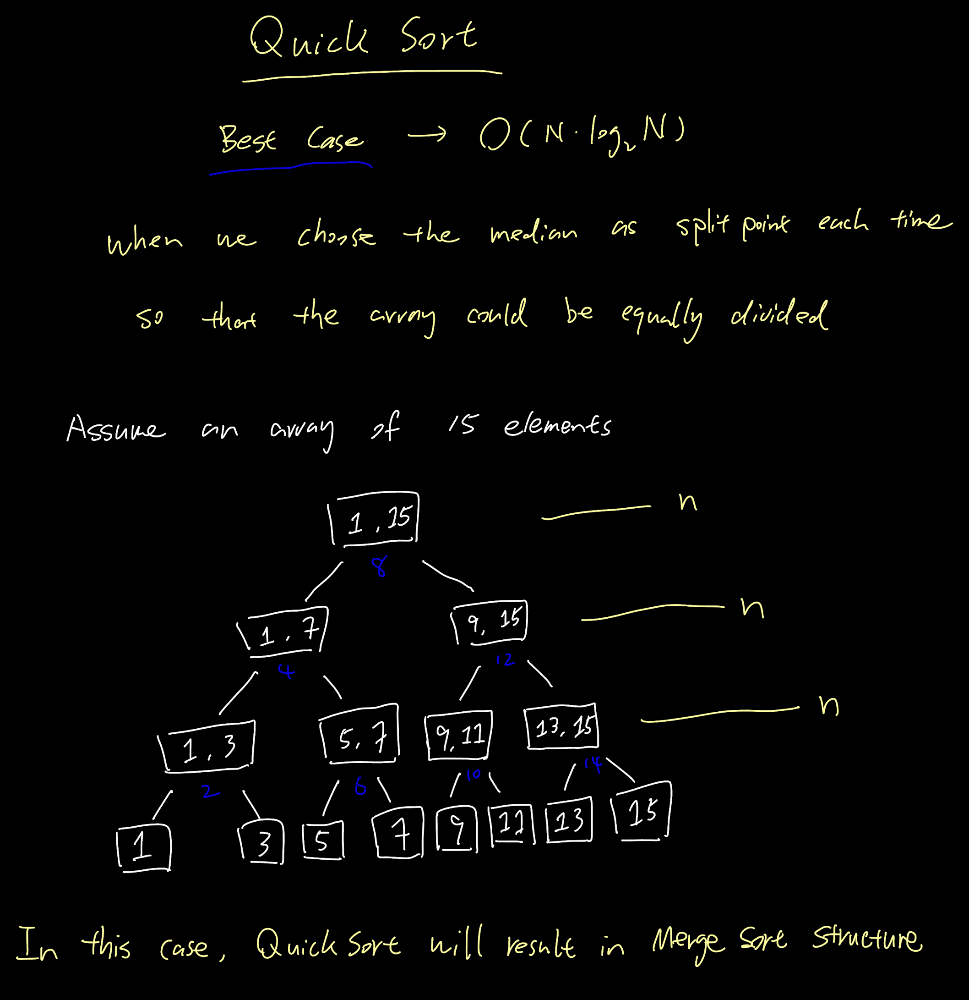

# Names 
```
#: pound 
&: ampersand 
*: asterisk
```

# &#x250f; Template 

# &#x250f; Linked List +

### &#x2317; circular

### &#x2317; doubly

### &#x2317; reverse

# &#x250f; Recursion
```
A function calls itself in order to divide work into smaller portions

1) base case:               when the program stops
2) general case:            how should the program calls itself
3) recursive algorithm:     an algorithm described in terms of base cases and general cases
```
#### &#x2314; Factorial Code
```
recursive definition:
---------------------
> n! = 1 if n = 0;
> n! = n * (n-1)! if n > 0
-> 4! = 4*3! = 4*3*2! = 4*3*2*1! = 4*3*2*1*0! = 4*3*2*1*1 = 24
```
*code*
```
// Iterative solution 
int Factorial(int number) {
    int fact = 1;
    for (int count = 2; count <= number; count ++) {
        fact = fact * count;
    }
    return fact;
}

// Recursive solution 
int Factorial(int number) {
    if (number == 0)            // Base Case
    {
        return 1;
    }
    else                        // General Case 
    {
        return number * Factorial(number-1);
    }
}
```
*1) iterative solution uses a looping construct (for loop)* <br>
*2) recursive solution uses a **branching** construct (the if-else statement)*


### &#x2317; Verifying Recursive Functions
#### &#x2314; method 1: walking through the whole execution --> tedious but useful
#### &#x2314; method 2: Three-Question Method
```
• Base-Case Question
    + Is there a non-recursive case in the method, and does it work correctly?
• Smaller-Caller Question 
    + Does each recursive call involve a smaller case of the problem
• General-Case Question
    + Assuming the recursive calls work correctly, does the rest of the function work correctly?

```
### &#x2317; Analysis Recursion
```
1) base-case question: 
    > the base case occurs when n=1
    > and it returns 1 with no further recursion
2) smaller-caller question:
    > each recursive call subtract 1 from n
    > which will eventually reach 0
3) general-case question:
    > assuming factorial (n-1) returns the correct answer
    > n * factorial(n-1) corresponds with the mathematical formula
```
### &#x2317; Design Recursion 1
```
Q: Check if a particular value is in a list?

1) base-case one:
    > the item is at the given index, return true
    x the item is at the given index, return true: because item can also not in the list
2) base-case two:
    > the end of the list has been reached (index == length -1), return false
3) general-case:
    > the item is in the rest of the list, recursively call itself

----------------------------------------------------------------------------------------
// list a abstract data type here
bool ValueInList(ListType list, int value, int startIndex)
{
    if (list.info[startIndex] == value) {
        return true;                                        // base case 1
    }
    else if (startIndex == list.length - 1) {               // base case 2
        return false;
    }
    else {
        return ValueInList(list, value, startIndex+1);
    }
}
```
### &#x2317; Design Recursion 2
```
Q: How many combinations of 5 books can be made from a group of 20 books? (n choose k)
Size: size of the group (n) and number of members in each group (k)

1) base-case:
    > if members == 1, return group
    > if members == group, return 1
2) general-case:
    > return combinations (group-1, members-1) + combinations (group-1, members)

----------------------------------------------------------------------------------------
int Combinations(int group, int members)
{
    if (members == 1) {
        return group;
    }
    else if (members == group) {
        return 1;
    }
    else {
        return (Combinations(group-1, members-1) + Combinations(group-1, members));
    }
}
```


##### &#x21e2; Recursive Binary Search 
```
• pseudocode

FUNCTION binary_search(array, start, end, x) 

WHILE start < end Do 
            
            mid:= (start + end) / 2 

            IF x == array[mid] THEN 
                RETURN mid 

            ELSE IF x > array[mid] THEN 
                RETURN binary_search(array, mid+1, end, x)

            ELSE RETURN binary_search(array, start, mid-1, x)

    END WHILE 
END FUNCTION
```


### &#x2317; How Recursion Works? 

#### &#x2314; Binding 
```
associating a memory address with a variable name
```
##### &#x21e2; Static Binding 
*`+ occurs at compile time`*
```
1) When a program is compiled, each variable is entered into a symbol table and bound to a memory address
                                                               ------------
2) Each reference to the variable name is replaced by the memory address
        ---------                                         --------------
3) Function parameters and local variables are also bound to memory addresses at this time
   -------------------     ---------------      
```
*`+ Symbol Table`*
```
Three variables are declared: int a, b, c -> The compiler binds them in the symbol table:
                            ---------------------------
                            |   Symbol      Address   |
                            |     a           0001    |
                            |     b           0002    |
                            |     c           0003    |
                            ---------------------------
                            A statement such as: a = b + c 
    -> "get value started at 0002, get the value stored at 0003, store the sum in 0001" (assembly language)
```


*`+ issues`*
```
1) each parameter and local variable has a single, fixed memory address associated with it
*2) a recursive function call would overwrite the variables of the previous call
*3) each recursive call needs memory to store its own variables
4) Therefore, langauges that only have static storage allocation cannot support recursion
```

##### &#x21e2; Dynamic Binding
*`+ occurs at run-time`*
```
1) Variable names are bound to memory addresses at run time
                                                -----------
2) The compiler references variables by their offsets instead of by exact addresses. 
    + The correct addresses are calculated during execution using these offsets.
                                                                        ---------> 偏移量
3) variables and parameters for function stored in the Activation Record
                                                       -----------------
```
#### &#x2314; Activation Records
##### &#x21e2; need to know
```
functions need to store local variables, parameters, and return address
    + return address: where execution returns to, once execution of the function has completed
```
##### &#x21e2; what is this 
```
Activation Record: 
    + a record used at run time to store information about a function, 
        1) its variables 
        2) parameters 
        3) return address 
        4) register values
    + also call stack frame
                -----------
    + every function call creates a new activation record, which is deleted once the call is complete
```


#### &#x2314; Run-Time Stack


##### &#x21e2; Ex: Run-Time Stack of Factorial(4)
```
1) at address 5200 is the statement: answer = Factorial(4);
2) this starts the recursive algorithm by pushing an activation record onto the stack
3) the recursive call inside Factorial is at address 1010: return number * Factorial(number-1)
4) refer to above for original code in C++

|
V
5200 -> answer = Factorial(4)
    |
    V
    1010 -> return number * Factorial(number-1)
    --------------------------------------------------
    | Call number | Number | Result | Return address |
    |-------------|--------|--------|----------------|
    |      1      |   4    |   ???  |      5200      |
    |-------------|--------|--------|----------------|
    |             |        |        |                |
    |-------------|--------|--------|----------------|
    |             |        |        |                |
    |-------------|--------|--------|----------------|
    |             |        |        |                |
    |-------------|--------|--------|----------------|
    |             |        |        |                |
    --------------------------------------------------
    |
    V 
    1010 -> the activation record contains the parameter (4), the result (unknown), and the return address (5200)
    --------------------------------------------------
    | Call number | Number | Result | Return address |
    |-------------|--------|--------|----------------|
    |      1      |   4    |   ???  |      5200      |
    |-------------|--------|--------|----------------|
    |      2      |   3    |   ???  |      1010      |
    |-------------|--------|--------|----------------|
    |             |        |        |                |
    |-------------|--------|--------|----------------|
    |             |        |        |                |
    |-------------|--------|--------|----------------|
    |             |        |        |                |
    --------------------------------------------------
    |
    V
    1010 -> the recursive calls continue, since the base case had not been reached yet (number == 0)
    .
    .
    .
    |
    V 
    1010 -> base case reached, start popping the run-time stack, propagating the result back to the original call
    --------------------------------------------------
    | Call number | Number | Result | Return address |
    |-------------|--------|--------|----------------|
    |      1      |   4    |   ???  |      5200      |
    |-------------|--------|--------|----------------|
    |      2      |   3    |   ???  |      1010      |
    |-------------|--------|--------|----------------|
    |      3      |   2    |   ???  |      1010      |
    |-------------|--------|--------|----------------|
    |      4      |   1    |   ???  |      1010      |
    |-------------|--------|--------|----------------|
    |      5      |   0    |    1   |      1010      |
    --------------------------------------------------
    |
    V 
    --------------------------------------------------
    | Call number | Number | Result | Return address |
    |-------------|--------|--------|----------------|
    |      1      |   4    |   ???  |      5200      |  6x4=24
    |-------------|--------|--------|----------------|
    |      2      |   3    |   ???  |      1010      |  2x3=6
    |-------------|--------|--------|----------------|
    |      3      |   2    |   ???  |      1010      |  1x2=2
    |-------------|--------|--------|----------------|
    |      4      |   1    |    1   |      1010      |  1x1=1
    |-------------|--------|--------|----------------|
    |             |        |        |      1010      |
    --------------------------------------------------
    .
    .
    .
    |
    V 
    5200 -> the final result is calcualted (24), and returned to address 5200
         -> the result is stored at answer and the main method continues executing
    --------------------------------------------------
    | Call number | Number | Result | Return address |
    |-------------|--------|--------|----------------|
    |      1      |   4    |   24   |      5200      |
    |-------------|--------|--------|----------------|
    |             |        |        |                |
    |-------------|--------|--------|----------------|
    |             |        |        |                |
    |-------------|--------|--------|----------------|
    |             |        |        |                |
    |-------------|--------|--------|----------------|
    |             |        |        |                |
    --------------------------------------------------
```

##### &#x21e2; Recursion Depth 
```
The number of recursive calls constitutes the depth of recursion

ex). 

template<class ItemType>
void Insert(NodeType<ItemType>*& listPtr, ItemType item)
{
    if (listPtr == NULL || item < listPtr->info)
    {
        // Save current pointer 
        NodeType<ItemType>* tempPtr = listPtr;

        // Get new node
        listPtr = new NodeType<ItemType>;
        listPtr->info = item;
        listPtr->next = tempPtr;
    }
    else Insert(listPtr->next, item);
}
```


# &#x250f; Binary Search Tree (BST)

[**`+ incorrect way of thinking BST`**](https://www.enjoyalgorithms.com/blog/validate-binary-search-tree)

### &#x2317; BST properties 
**`+ code`[[1]](./advanced/BST/TreeType.h)[[2]](./advanced/BST/TreeType.cpp)[[3]](./advanced/BST/main.cpp)**
```cpp
// recursively comparing the current with the previous one
// recursion make the checking start from the leaf, so prevNode refer to smaller one (if BST)
bool checkBST(TreeNode* tree, TreeNode& prevNode)
{
    if (tree == NULL) {
        return true;
    }
    bool Left = checkBST(tree->left, prevNode);
    if (prevNode && tree->info < prevNode->info) {      // check if prevNode has address & info < prevNode->info
        return false;
    }

    prevNode = tree;
    bool Right = checkBST(tree->right, prevNode);
    if (Left == true && Right == true) {
        return true;
    }
    else {
        return false;
    }
}

bool TreeType::IsBST()
{
    TreeNode prev;                          // create new Node, no info stored, only address 
    return checkBST(root, prev);
}

=========================================== algorithm walk through ================================================
• checkBST function will end when reach the bottom line, no iteration inside, no "loop" inside
• code is executed one line by one line, from top to down


                                    [ complete binary tree ]

                                                        e
                             down to up ^             /   \
                                        |            c     g
                                                    / \   / \
                                        start -->  a   d f   z 
-------------------------------------------------------------------------------------------------------------------
                      |
                      |
                      V
             --------------------
             |  Enter Function  |
             --------------------      $ Loop a
                      |                1) tree = a->left = NULL
                      |                2) prevNode exist, and a > prevNode->info=NULL: pass
                      |                3) Left:  tree = a -> checkBST(a->left, '1')=true, '1' < prevNode = a
                      |                4) Right: tree = a -> checkBST(a->right, '1')=true, (Left & Right)=true
                      |                5) Return true, get out of Loop a
                      |                ----------------------------------------------------------------------------
                      V               |                                                                           |
               tree = e != NULL       |                                                                           |
               prevNode = prev        | -------------                                                             |
                      |               | |           |                                                             |
                      |               | |           | $ Loop c                                                    |
                      |               | |           | 1) tree = c->left = a != NULL                               |
                      V               V V           | 2) Left: tree=c -> checkBST(c->left, prev): enter Loop a    |
        left = checkBST(tree->left, prev)           | 3) Left=true, prevNode=c = exist, and c > a: pass           |
        tree = c != NULL              | |           | 4) Right: tree=d -> checkBST(d->left, c), prevNode=d        |
                      |               | |           | 5) Left & Right = true                                      |
                      |               | |   Loop c  |                                                             |
                      |               | -------------                                                             |
                      |               |                                                                           |
                      V               |     Loop a      *step 4 enter Loop d, but similar to a so refer to Loop a |
                prevNode = e          -----------------------------------------------------------------------------
      right = checkBST(tree->right, prevNode)
                tree = g != NULL
                      |
                      |
                      |                                                       loop f
 -------------------> | ------------------------------------------------------------
 |                    |                                           Loop g           |
 |    --------------> | ------------------------------------------------           |
 |    |                                                                |           |
 |    |      $ Loop g                                                  |           |
 |    |      1) tree = g ! = NULL                                      |           |
 |    |      2) Left: tree=g -> checkBST(g->left, e) enter Loop f      |           |
 |    |      3) Left=true, prevNode = e = exist, and g > e: pass       |           |
 |    |      4) prevNode=g                                             |           |
 |    |      5) Right: tree=z -> checkBST(z->left, g) = true           |           |
 |    |      6) Return true, get out of the function                   |           |
 |    |      * step 5 enter Loop z but omit because resemble Loop f    |           |
 |    ------------------------------------------------------------------           |
 |                                                                                 |
 |       $ Loop f                                                                  |
 |       1) tree = f->left = NULL                                                  |
 |       2) Left:  tree = f -> checkBST(f->left, e) = true, prevNode = f           |
 |       3) Right: tree = f -> checkBST(f->right, e) = true, (Left & Right)=true   |
 |       4) Return true, get out of Loop f                                         |
 -----------------------------------------------------------------------------------
```


# &#x250f; Priority Queue 

### &#x2317; Queue
```
• Enqueue an item 
• Dequque: Item returned has been in the queue the longest amount of time (FCFS)
```
### &#x2317; Priority Queue 
```
• Enqueue a pair <item, priority>
• Dequeue: Item returned has highest priority
```

### &#x2317; Application Layer 
```
A priority queue is an ADT with the property that only the highest-priority element can be accessed at any time
```
#### &#x2314; Server Systems
```
some examples
```
#### &#x2314; Some Graph Algorithm 
```
• Dijkstra Algorithm 
• Spanning Tree Algorithm
```

### &#x2317; Implementation (refer to below heap section)
```
enqueue and dequeue: both O(logN) steps, even in the worst case
```

# &#x250f; Heap
### &#x2317; Tree 
##### &#x21e2; Full Tree
```
: a binary tree in which each node has 0 or 2 children

                        -----
                        |   |    2 children
                        -----
                       /     \
                      /       \
                   -----     -----
        0 child    |   |     |   |    2 children
                   -----     -----
                            /     \
                           /       \
                        -----     -----
            0 child     |   |     |   |    0 child
                        -----     -----

```
##### &#x21e2; Complete Binary Tree
```
1) a binary tree in which every level, except possibly the last, is completely filled
2) all nodes are as far left as possible(AFAL)


                    TreeNode •
                             |
                             V
            ---------------- A ---------------- Level 0: Filled? Yes
                            / \ 
                           /   \
                          /     \
                         /       \
            ----------- B ------- C ----------- Level 1: Filled? Yes, at most nodes at level 1
                       / \       /
                      /   \     /
            -------- D --- E - F -------------- Level 2: Filled? No, maximally 4 nodes, but only 3
                    / \       / \
            ------ G - H --- I - J ------------ Level 3: children should be filled under D first then E (AFAL)
```


#### &#x2314; Shape 
```
its shape must be a complete binary tree!
```
#### &#x2314; Order
```
For each node in the heap, the value inside is greater or equal to the value in each of its children
greater (>) or equal (=)


ex).

            C                   50                      70
           / \                 /  \                    /  \
          A   T               20  30                 60    12
                             /  \                   /  \  /
                            18  10                 40  30 8
```
##### &#x21e2; Numbering Nodes Left to Right by Level, storing nodes in array using numbering as index


##### &#x21e2; exercise 
```
Q: tree elements stored in by level, from left to right 

    ----------------------------------------
    | 13 | 3 | 4 | 10 | 23 | 31 | 100 | 32 |
    ----------------------------------------

1) draw the complete binary tree 
2) find the parent of node 5, which is the fifth node (without drawing the tree)
    + odd index always is left child
    + even index always is right child, except 0
3) where are the left child of node 2, right child ?


// Heap Specification (.h)
```
#### &#x2314; Heap Specification (.h)
```cpp
// Heap Specification 

template<class ItemType>
// Assumes ItemType is either a built-in simple type or a class with overloaded relational operators
struct HeapType 
{
    void ReheapDown(int root, int bottom);
    void ReheapUp(int root, int bottom);
    ItemType* elements;                     // Array to be allocated dynamically 
    int numElements;
};
```
#### &#x2314; Implementation 

**`+ Swap()`**
```cpp 
// simple operatrion function that ReheapUp and ReheapDown to work
template<class ItemType>
// template here means that ItemType is a generic type, which can be substituted with any type(int, etc)
void Swap(ItemType& one, ItemType& two)
{
    ItemType temp;
    temp = one;
    one = two;
    two = temp;
}
```

**`+ ReheapDown()`**
```cpp 

// each comparison involving three nodes in every recursion 
// like this 
//                        -----
//                        |   |     <- maintain
//                        -----
//                       /     \
//                      /       \
//                   -----     -----
//    maintian ->    |   |     |   |    <- maintain
//                   -----     -----
//                  
// ReheapDown maintain the heap property of the whole tree!


// remember that in order to be a heap, there's a SHAPE and ORDER properties
// SHAPE: complete binary tree 
// ORDER: every node must greater or equal to its children node
tempalte<class ItemType>
void HeapType<ItemType>::ReheapDown(int root, int bottom)
// Post: Heap properties is restored 
{
    int maxChild;
    int rightChild;
    int leftChild;

    // calculation based on index 
    leftChild = root*2 + 1;
    rightChild = root*2 + 2;

    // all are index, bottom meaning the length
    if (leftChild <= bottom)
    {
        if (leftChild == bottom) {
            maxChild = leftChild;
        }
        else {
            if (elements[leftChild] <= elements[rightChild]) {   // elements is an array, data member
                maxChild = rightChild;
            }
            else {
                maxChild = leftChild;
            }
        }
        if (element[root] < elements[maxChild]) {         
            Swap(elemenet[root], elements[maxChild]);  // maxChild is an index
            ReheapDown(maxChild, bottom);              // recursion starts at position of maxChild, not the value
        }
    }
}

```


**`+ ReheapUp()`**
```cpp

//                        -----
//                        |   |     <- maintain
//                        -----
//                       /     \
//                      /       \
//                   -----     -----
//                   |   |     |   | 
//                   -----     -----
//                  /     \
//                 /       \
//              -----     -----
//              |   |     |   |     <- maintain
//              -----     -----

//
// ReheapUp only maintain the heap property of the top and bottom
// bottom is the index of last node, root is top one at index 000 
// not necessarily maintain the whole tree, because when new item is not greater than root, nothing happens

template<class ItemType>
void HeapType<ItemType>::ReheapUp(int root, int bottom)
// pre: bottom is the index of the node that may violate the heap order, 
//      the order property is satisfied from root to next-to-last node 
// Post: Heap order property is restored between root and bottom
{
    int parent;

    if (bottom > root)
    {
        parent = (bottom-1)/2;                         // calculating parent index, flooring and ceiling sometimes
        if (elements[parent] < elements[bottom]) 
        {
            Swap(elements[parent], elements[bottom]);  // calculating from bottom to top
            ReheapUp(root, parent);
        }
    }
}

```

##### &#x21e2; Why not always ReheapDown ?
```
because different conditions in different algorithm for them to process 
1) ReheapDown: continue when leftChild is less or equal than bottom leaf 
2) ReheapUp:   continue when bottom is gerater than root
```


#### &#x2314; Implement Priority Queue with Heap
##### &#x21e2; Two Issues
```
1) Dequeue 
    -> return the root of the heap, leaving a hole at the top
    -> how to fill the hole without violating the heap property

-----------------------------------------------------------------------------

2) Enqueue 
    -> place an element as the bottom element 
    -> which not be the appropriate position according to new element's value

```

**`+ PQType Declaration()`**
```cpp 
class FullPQ{};
class EmptyPQ{};
template<class ItemType>                    // template

class PQType 
{
public:
    PQType(int);                            // constructor 
    ~PQType();                              // destructor

    void MakeEmpty();                       // empty the array 
    bool IsEmpty() const;                   // check if the array is empty 
    bool IsFull() const;                    // check if the array is full
    void Enqueue(ItemType newItem);         // Enter an item at the end of the array then call ReheapUp()
    void Dequeue(ItemType& item);           // Remove the root and call ReheapDown()

private:
    int length;
    HeapType<ItemType> items;
    int maxItems;
}
```

**`+ PQType Definition()`**
```cpp
template<class ItemType>
PQType<ItemType>::PQType(int max)
{
    maxItems = max;
    items.elements = new ItemType[max];
    length = 0;
}

template<class ItemType>
PQType<ItemType>::~PQType()
{
    delete [] items.elements;
}

template<class ItemType>
void PQType<ItemType>::MakeEmpty()
{
    length = 0;
}

template<class ItemType>
bool PQType<ItemType>::IsEmpty()
{
    return length == 0;
}

template<class ItemType>
bool PQType<ItemType>::IsFull()
{
    return length == maxItem;
}
```

##### &#x21e2; Solutions to Two issues
```
solution 1) for Dequeue()
    + call ReheapDown() after place the bottom item to the root
    + before dequeue heap propertiy maintain, after replacing root with bottom, must violating property
    + so starting from root check down

solution 2) for Enqueue()
    + the reason no using ReheapDown() is because adding new item necessarily violating the heap property
```

**`+ Enqueue()`**
```cpp 
template<class ItemType>
void PQType<ItemType>::Enqueue(ItemType newItem)
{
    if (length == maxItems)
        throw FullPQ();
    else 
    {
        length++;
        items.elements[length-1] = newItem;
        items.ReheapUp(0, length-1);
    }
}
```

**`+ Dequeue()`**
```cpp 
template<class ItemType>
void PQType<ItemType>::Dequeue(ItemType& item)
{
    if (length == 0)
        throw EmptyPQ();
    else 
    {
        item = items.elements[0];
        items.elements[0] = items.elements[length-1];
        length--;
        items.ReheapDown(0, length-1);
    }
}
```
##### &#x21e2; Time Complexity


# &#x250f; <a name="heapsort"></a> Heap Sort
```
1) search for the highest value 
|
V
2) insert it at the last position 
|
V
3) repeat for the next highest value
```
##### &#x21e2; downside
```
search for second/next highest value in the list makes this selection sort inefficient
```
##### &#x21e2; overcome downside
```
heap for this selection sort efficient, because only need to select highest for each recursion/iteration 
```
##### &#x21e2; steps 
```
remove the root --> ReheapDown --> repeat
```

#### &#x2314; Building a Heap (heapify)
##### &#x21e2; meet preconditions -> ReheapDown()
```
1) unsorted list is a tree
2) there are no holes in the array
3) all the leaf nodes are heaps already
```
##### &#x21e2; start with Unsorted List


##### &#x21e2; Find first non-leaf node
```
firstNonLeaf = maxLen/2 - 1;

ex). if we have length of 9, 9(index 0 - 8) nodes at total and will form a tree like the following:

                                ◯
                               / \
                              ◯   ◯
                             / \ / \
                            ◯  ◯ ◯  ◯
                           / \ 
                          ◯   ◯

index:  -> 4, 5, 6, 7, 8 are leaf nodes 
        -> 9/2 -1 by default in C++ is taking the floor 
        -> so 3
        -> we need the first non-leaf node 
        -> start from there and looping through all non-leaf node backward

                                ◯
                              /   \
                             ◯     ◯
                           /  \   /  \
                          ◯    ◯ ◯    ◯
                         / \  / \
                        ◯   ◯ ◯  ◯

index: 5, 6, 7, 8, 9, 10 are leaf nodes -> take floor(11/2)-1 = 4

```

**`+ HeapSort()`**
```cpp 
template<class ItemType>
void HeapSort(ItemType values[], int numValues)
// Assumption: Function ReheapDown is available 
// Post: The elements in the array values are sorted by key 
{
    int index;
    // convert the array of values into a heap -> heapify
    for (index = numValues/2 - 1; index >= 0; index--)
        ReheapDown(values, index, numValues-1);
    // Sort the array 
    for (index = numValues-1; index >= 1; index--)
    {
        Swap(values[0], values[index]);
        ReheapDown(values, 0, index-1);
    }
}
```


##### &#x21e2; Sorted Item is placed at the end of the array 
```
Q).
taking an array of length m for heap sort, stop at the n th recursion (n<m), what will happen?

A).
n elements at the back of the array are sorted
```
# &#x250f; Hash

### &#x2317; Set 
#### &#x2314; Logical Level 
```
An unsorted collection of distinct values, based on the mathematical concept
                          --------
```
##### &#x21e2; Component(base) Type
##### &#x21e2; Subset
##### &#x21e2; Universal Set
##### &#x21e2; Empty Set

#### &#x2314; Set Operations
##### &#x21e2; Store & Delete 
##### &#x21e2; Union
##### &#x21e2; Intersection
##### &#x21e2; Difference 
##### &#x21e2; Cardinality

##### &#x21e2; Ex)
```
SetA = {A, B, D, G, Q, S}
SetB = {A, D, P, S, Z}

Union(SetA, SetB) = {A, B, D, G, P, Q, S, Z}
Intersection(SetA, SetB) = {A, D, S}
Difference(SetA, SetB) = {B, G, Q}              // order difference
Difference(SetB, SetA) = {P, Z} Q}              // order difference
```
#### &#x2314; Application Level 
#### &#x2314; Implementation Level

### &#x2317; Map
#### &#x2314; Logical Level
##### &#x21e2; An ADT that is a collection of *key-value pairs*
```
1) key: a value of the base type of the map, used to look up an associated value 
2) store unsorted, unique values 
3) do not support Union, and etc. No mathematical basis 
4) Supports Find O(1)
```
#### &#x2314; Application Level
#### &#x2314; Implementation Level
#### &#x2314; O(1) Search 
```
always big O of 1 for search if you have key in maps: Hashing = map + set
```

### &#x2317; Hashing 
```
a technique for ordering and accessing elements in a list by manipulating the keys of the elements
```
#### &#x2314; Hash Function
```
a function that manipuates the key to produce an array index 
                                      ----------------------
```
##### &#x21e2; Ex). h(k) = return (k mod m)


#### &#x2314; Collisions
```
when multiple keys produce the same hash location 

ex). 01234 and 97534 mod 100 both produce hash value of "34"
```

##### &#x21e2; Linear Probing
```
1) Resolves hasd collisions by searching for the next available space 
2) If the end of the hash is reached, linear probing loops around to the beginning 
3) check if an item is in the hash table 

    -> calculate the hash and search sequentially until the matching key is found 
    -> stop when an empty space or the orginal hash is found
```


**`+ h(k) = k mod m`**
```
insert keys: {0, 1, 4, 9, 16, 25, 36, 49, 64, 81}

        -----                 ------
     0  |   |                 | 0  |  0
        -----                 ------  
     1  |   |                 | 1  |  1
        -----                 ------
     2  |   |                 | 49 |  2
        -----                 ------
     3  |   |                 | 81 |  3
        -----                 ------
     4  |   |       -->       | 4  |  4
        -----                 ------
     5  |   |                 | 25 |  5
        -----                 ------
     6  |   |                 | 16 |  6
        -----                 ------
     7  |   |                 | 36 |  7
        -----                 ------
     8  |   |                 | 64 |  8
        -----                 ------
     9  |   |                 | 9  |  9
        -----                 ------
```

##### &#x21e2; Issues with Linear probing => rehashing
```
1) deleting an item creates an empty spot, when three items with the same hash and second is deleted
   Linear Probing stop 

2) Clustering Issue 
    + collisions happen
    + when items not in the direct hash value position, searching increase, time complexity -> O(n)
    + the point of using hashing is the big O of 1 searching time

3) Rehashing: (hash value + c) % s

    + Quadratic Probing 
    + Random Probing
```

##### &#x21e2; Quadratic Probing
```
example
```

#### &#x2314; Buckets & Chaining 
```
Handle collisions by allowing multiple elements to have the same hash value 
```

##### &#x21e2; Bucket 
```
A collection of values associated with the same hash key; has limited space
```


##### &#x21e2; Chain 
```
A linked list of elements that share the same hash key; the hash table has pointers to list of values
```


##### &#x21e2; Chaining Example 
```
The hash table is an array of linked lists 

Insert Keys: 0, 1, 4, 9, 16, 25, 36, 49, 64, 81
    • elements would be associated with the keys 
    • using the hash function h(k) = k mod m 
    • m = 10 (which is the size of the original array)


            -----    -----                      -----    -----
            | 0 | -> | 0 |                      | 0 | -> | 0 |
            |---|    -----                      |---|    ------    -----
            | 1 | -> | 1 |                      | 1 | -> | 81 | -> | 1 |
            |---|    -----                      |---|    ------    -----
            | 2 |                               | 2 |
            |---|                               |---|
            | 3 |                               | 3 |
            |---|    -----                      |---|    ------    -----
            | 4 | -> | 4 |                      | 4 | -> | 64 | -> | 4 |
            |---|    ------                     |---|    ------    -----
            | 5 | -> | 25 |       ---->         | 5 | -> | 25 |
            |---|    ------                     |---|    ------    ------
            | 6 | -> | 16 |                     | 6 | -> | 36 | -> | 16 |
            |---|    ------                     |---|    ------    ------
            | 7 |                               | 7 |
            |---|                               |---|
            | 8 |                               | 8 |
            |---|    -----                      |---|    ------    -----
            | 9 | -> | 9 |                      | 9 | -> | 49 | -> | 9 |
            -----    -----                      -----    ------    -----

Note that: 
new node is adding at the front, because the of the properties of adding new nodes to linked list
```

##### &#x21e2; Probing v.s. Chaining 


```
Search: 
    1) Probing must continue searching the array until all possible hash keys have been checked. 
    2) Chaining only looks through the chain, which is likely to be relatively small

*Deletion: 
    1) Chaining simply removes the element from the linked list. 
    2) Probing requires special signal values
```

#### &#x2314; Choosing a Good Hash Function 
```
+ A good hash function reduces colliisions by uniformly distributing elements 

    1) Division Method 
        • key % size 
        - by making the table larger than the expected number of elements, collisions can be reduced
        - very efficient, but collisions can be common

    2) Other Methods
        • folding: break the key into multiple pieces and concatenate or XOR the pieces to make a complete hash key

    3) Creating a Good Hash Function 
        • Efficiency 
        • Simplicity 
        • Perfect hash functions: are difficult but not impossible, especially for small sets of values.
```
<br>

# &#x250f; Sorting 

### &#x2317; Algorithm Evaluation
```
1) The number of comparisons made 
2) The number of times data is moved 
3) The amount of additional memory used
```

### &#x2317; Sorting Efficiency (not time complexity)
```
• Worst Case: The data is in reverse order 

• Average Case: Random Data, may be somewhat sorted already 

• Best Case: The array is already sorted 

=> Typically, average and worst case performance are similar, if not identical 
=> For many algorithms, the best case is also the same as the other cases
```

### &#x2317; Basic Sorting Algorithms 

#### &#x2314; Selection Sort
```
1) set "current" to the first index of the array 
2) Find the smallest value in the array 
3) Swap the smallest value with the value in the current 
4) Increment current and repeat steps 2-4 until the end of the array is reached

=> note: the algorithm do the sorting forward, won't touch the order of the other portion of the array
```


##### &#x21e2; Analyze Selection Sort
```
• A very simple, easy-to-understand algorithm 
• N iterations are performed 
• Iteration I checks N - I items to find the next smallest values 
```

$$ N*(N-1) \over 2 $$
<center>Comparisons in Total</center>

```
because less comparisons after some comparisons is finished
• Therefore, selection sort is O(N^2)
• Even in the best case, still O(N^2)
```


#### &#x2314; Bubble Sort
``` 
1) Set "current" to the first index of the array 
2) For every index from the end of the list to 1, swap adjacent pairs of elements that are out of order
    + The name comes from how smaller elements "bubble up" to the top of the array
    + The inner loop compares values[index] < values[index-1], and swaps the two values if it evaluates to true
    + The smallest value is brought to the front of the unsorted portion
3) Increment current and repeat steps 2-3
4) Stop when current is at the end of the array
```


##### &#x21e2; Analyze Bubble Sort
```
• Takes N-1 iterations, because the last iteration puts two values in order
• Each iteration I perform N-I comparisons 
• Bubble sort is therefore O(N^2)
• It may perform several swaps per iteration 
• An already-sorted array needs only 1 iteration, so the best case is O(N)
```

#### &#x2314; Insertion Sort
```
1) Iterate from arr[1] to arr[n] over the array 
2) Compare the current element (key) to its predecessor 
3) If the key element is smaller than its predecessor, compare it to the elements before
    + Move the greater elements one position up to make spaec for the swapped element 
4) Increment key and repeat steps 2-4 until the end of the array is reached
```


##### &#x21e2; Analyzing Insertion Sort 
```
pseudocode 
--------------------------------------
for j = 2 to n {
    key = A[j];
    i = j - 1;
    While (i > 0) and (A[i] > key) {
        A[i+1] = A[i];
        i = i - 1;
    }
    A[i+1] = key;
}
--------------------------------------

• O(N^2), like the bubble sorts 
• Best Case: O(N), since only one comparison is needed, and no data is moved
```

### &#x2317; O(N log<sub>2</sub>N) Sorting Algorithms
```
• O(N^2) is not good enough when sorting large sets of data 

• Splitting the array in half, sorting and then merging the two arrays is (N/2)^2 + (N/2)^2 
• This "divide-and-conquer" approach can then be applied to each half, giving "NlogN" time complexity sort
```

#### &#x2314; Merge Sort
```
1) Split the array in half 
2) Recursively MergeSort the two halves 
3) Merge the two halves 
4) Base Case: Arrays of < 2 elements are already sorted
```

##### `+ Divide`


##### `+ Conquer`


##### `+ Merge`


```
1) Simultaneously walk through both arrays 
2) If item A < item B, copy item A into the temp array and get the next item from A 
3) If item B < item A, copy item B into the temp array and get the next item from B 
4) Stop when one of the the arrays is empty; copy any remaining elements from the other array 
5) Copy the temp array into the original array


pseudocode 
-------------------------------
MERGE-SORT(A, p, r)
    if p < r 
        q = floor((p+r)/2)
        MERGE-SORT (A, p, q)
        MERGE-SORT (A, q+1, r)
        MERGE(A, p, q, r)
-------------------------------

```

##### &#x21e2; Analyzing Merge Sort
```
1) The array is split into smaller and smaller arrays until it is finally split into 1- or 0- element arrays 
2) Merging all of these 1-element arrays into 2-element arrays is O(N)
3) This O(N) merge repeats for each split, which happens logN times for O(NlogN) total 
4) However, merge sort requires O(N) addidtional memeory to perform the merge 
    ! extra memeory(space) for a size of an array for temporarily holding data, sorting in not in place
```

##### `+ Merging Level`


#### &#x2314; Quick Sort
```
1) Choose a value from the array 
2) Use this value to split the array into: 
    - all the values that are less than or equal to the split 
    - all the values that are greater than the split 
3) Recursively quick sort the two subarrays 


pseudocode: 
---------------------------------------------------------------------------------------
// Problem: Sort an array-based list of values 
// Size: values[first] to values[last]
// Base Case: if there are fewer than 2 items in values[first] to values[last], do nothing 
// General Case: Split the array and quick sort the two halves

QuickSort(first, last)
{
    if (first < last)
    {
        j = split(first, last);
        QuickSort(first, j);
        QuickSort(j+1, last);
    }
}

---------------------------------------------------------------------------------------
```

**`+ Splitting Algorithm`**
```
QuickSort is not sorting, is just making sure the values are on the correct side of the pivot
---------------------------------------------------------------------------------------------

Concept walk through: 
1) choose the split value (usually we choose the element in the first index)
2) two indices: first and last
3) first start looping to the end of the array, last start looping to the start of the array 
4) if the first finds a value that is greater than the split value, then stop 
5) if the last finds a value that is less than the split value, then stop 
6) swap these two values, let first and last continue loop through the array 
7) Repeat 4-6 until first and last meet, swap the pivot and last
```

##### &#x21e2; Analyzing Quick Sort 
##### `+ Best Case`


##### `+ Worst Case`


#### &#x2314; Heap Sort

##### [`+ algorithm`](#heapsort)
##### &#x21e2; Analyzing Heap Sort
```
1) The overheadl for building the heap is significant, O(N), and thus heap sort should be avoided for small arrays
2) ReheapDown is O(logN) and is called N times 
3) The overall performance is O(N logN)
4) The initial order of the elements doesn't matter 
5) No additional space is needed (unlike merge sort)
6) no worst case or best case: always one case for HEAP SORT
```

#### &#x2314; Other Considerations

##### &#x21e2; Efficiency
```
1) effiiency is not the only thing to consider when choosing which sorting algorithm to use 
2) in some case, O(N^2) may grow slower than O(NlogN)

3) when N is small enough, N^2 might be faster than NlogN 
    • O(N^2) sorts often have low overhead and few actions besides comparison 
    • O(NlogN) sorts ususally have more overhead and more actions, such as merging
```

##### &#x21e2; Space 
```
1) Merge Sort requires an additional N memory 
2) depending on the implementation and the data, QuickSort may use O(N) additional memory 
3) HeapSort is more algorithmically complex but uses no additional memory 
```

#### &#x2314; Stable Sorting Algorithms
##### &#x21e2; Keys and Stability
```
consider a situation: 
    • a record may contain multiple keys, such as a student's name, ID number, and major 
    • Some of these keys may not be unique 
    • What if we want a list sorted by major, but have alphabetical order of names within each major? 
    • sort twice, first by name and then by major 

    => this only works if the sort is stable!
```

##### &#x21e2; Stable Sort
```
: a sorting algorithm that preserves the order of duplicate keys (course ID has duplicate rows)

------------------------------------
| course ID | student ID | student |
|-----------|------------|---------|
|     .     |      .     |    .    | 
|     .     |      .     |    .    |
|     5     |     32     |   Ben   |
|     5     |     50     |   Tom   |
|     .     |      .     |    .    |
------------------------------------
```


##### &#x21e2; Unstable Sort 
```
Heap Sort is the only algorithm so far that is inherentiy unstablebe 
    + because of the heap properties 
    + root only need to be greater than or equal to child nodes(not stable for ordering)
```


##### &#x21e2; Sorting With Pointers 
```
-> Moving around large objects is ineffcient 
-> Instead, have an array of pointers to those large objects, and have the sort move the pointers 
-> The object don't move but can still be accessed in sorted order
```


##### &#x21e2; Caching
```
1) A small store of very fast memory, to access a small amount of memory quickly
2) The cache can store a very limited amount of data and code 
    • it may store only a few adjacent list elements 
    • and accessing other list elements requires fetching those elements from memory 
3) it takes as much time to access a memory cell as for the computer to execute 100 instructions 
    • an algorithm that makes good use of the cache will be faster than other algorithm that don't
```

##### &#x21e2; Sorting & Caching
```
1)_ Bubble Sort has predictable memory access patterns, and only compares adjacent elements, 
    which complements the cache's behavior 

2)_ Selection Sort must search the whole list for the next smallest, element, which will not work well 
    with the cache 

3)_ An array of pointers to objects sacttered throughout memory defeats the cache
    since there's no way to predict the next access
```

#### &#x2314; Radix Sort
```
• not a comparison sort 

• considers each position in the key and groups keys by their radix

• Radix: is the number of possibilities for each position -> the digits in a number system 
    - Lowercase letters have a radix of 26 
    - The base-10 digitis have a radix of 10
```

##### &#x21e2; Example
##### `1) how would you modify the Radix Sort to sort the list in descending order then ascending order?`


##### `2) does Radix Sort return correct sorting results when the input sequence contains negative value?`


##### &#x21e2; Analyzing Radix Sort
```
• Each item (N) is processed once for each position in the key (P)

• Radix sort is therefore O(N*P), but since P is likely small relative to N, it's simply O(N)

• Extra memory is needed for the queues 

=> no extra memory is needed if linked lists and linked queues are used 
=> because values can be moved from list to queue by changing the pointers
```

#### &#x2314; Parallel Merge Sort
```
1) sometimes O(NlogN) isn't enough 

2) Parallel processing performs multiple operations simultaneously, unlike the usual serial/sequential processing

3) Merge sort divides the work into ideal candidate for splitting among several threads
                                                                                -------
```


##### &#x21e2; Thread (线程)
```
For the first attempt at parallelizing Merge Sort, create a new thread for every recursive call 

                        -----
                        |   | <- create thread (parent thread)
                        -----
                       /     \ 
                    -----   -----
                    |   |   |   |   <- recursive call, they will create thread as well 
                    -----   -----
                      .       .
                      .       .
                      .       .

Each parent thread waits for the two child threads it spawns to finish, then merges
                   -----

=> this approach causes incredible slowdowns and will crash the program on large inputs
=> Each thread has a lot of overhead
```
##### &#x21e2; Chunks
```
: chunks is array size

1) at a certain array size, threads cost more than they could possibly save 
2) when the array is larger than a particular size, spawn new threads; otherwise use regular sequential merge sort 

3) The chunk size is how large arrays must be in order to create more threads 
       ----------        -----
4) This(chunks) is passed as a parameter to Merge Sort
```


##### &#x21e2; Avoiding Parallel Access 
```
1) Merge Sort works well in parallel because each divided part is independent 
2) None of the threads access parts of the array that another thread is using (unlike normal merge sort)
3) This kind of interaction can lead to incorrect and unpredictable result 

Worth to use? 
+ larger datasets and faster, more parallel-capable machines will have even better gains 

- parallel computing has complex code and complex bugs 

=> if implemented correctly, then worth
```

# &#x250f; Graphs 

### &#x2317; Definition 
• A **graph** is a set of **vertices** (nodes) and a set of **edges** that relate the vertices to each other
```
1) each vertex (nodes) is a "thing" or data point, such as a person or a city

2) Edges are represented as pairs of vertices (•-•-•-•-•)
                                                  ^    ^
                                                edge  vertex
3) Graphs are somewhat similar to binary trees, but have no restrictions on the connections between nodes

4) Formal Definition 
    • Graphs are based on the mathematical concept 
    • A graph G is defined as G = (V, E)
        - V is a finite, nonempty set of vertices 
        - E is a set of edges (written as pairs of vertices)
```

### &#x2317; Edge Direction 
#### &#x2314; Directed Graph 
```
Each edge is directed from one vertex to the other vertex, meaning having a direction -> or <-
```


##### `+ tree`


#### &#x2314; Undirected Graph 
```
Edges have no direction
```


#### &#x2314; Graph Concepts
##### &#x21e2; Adjacency
```
Two vertices are said to be adjacency if they are connected by an edge 

1) If they're connected by a directed edge 
    - The first vertex is adjacent to the second vertex 
    - The second vertex is adjacent from the first vertex 
2) A path is a sequence of vertices that connects two vertices in the graph
     ----      --------------------
```

##### &#x21e2; Completeness 
```
>> In a complete graph, every node is directly connected to every other node 

• A complete undirected graph with N nodes has: N*(N-1)/2 edges
    - think of comparison in sorting algorithm, selection sort 
    - each time one element is finished sorting, comparisons need to make descrese by one
    - same with graph, each vertex connect to all other vertices, connections descrese by one
```


```
• A complete directed graph with N nodes has:   N*(N-1) edges 
    - continue with undirected graph way of thinking 
    - each vertex not only has a edges going out, but also has a edge coming to it 
    - so each vertex has a 2-way relationship with each other 
    - double the formula
```


#### &#x2314; Weighted Graph
```
1) In a weighted graph, each edge has an associated value 
2) A weight typically represents the cost of moving between the two vertices

3) For instance, the weights on a graph of cities would be the distance between the cities 
4) The total distance between two cities is the sum of weights on the path between them

=> refer to below DFS example
```

### &#x2317; Graph Operations 
[`code`]()
#### &#x2314; Transformers
**`+ AddVertex()`** <br>
**`+ AddEdge()`** <br>
**`+ MakeEmpty()`** <br>
#### &#x2314; Observers
**`+ IsFull()`** <br>
**`+ IsEmpty()`** <br>
**`+ GetWeight()`** <br>
**`+ GetToVertices(): return a queue of adjacent vertices`** <br>
#### &#x2314; Others
**`...`**

### &#x2317; Graph: Application Level
```
Because => traversing(遍历) the graph is independent of the graph itself 
so      => graph traversal methods are separate from the graph operation
```

#### &#x2314; Depth-First Search
```
Follows a path as far as possible before backtracking (deep)
    - similar to postorder traversal of binary trees 

=> it is useful in graphs for checking if a path exists between two nodes (•-•-...-•)
```
##### &#x21e2; DFS algorithm 
```
1) add the nodes adjacent to the start node to the stack! 
2) Pop a node off the stack and examine it 
3) Add all of the nodes adjacent to the popped node to the stack 
4) Continue until the target node is found or the stack is empty (no more nodes to check)
```
##### &#x21e2; DFS Example


`ex). Flying from Austin to Washington`
```
1) Push Austin onto the stack
2) Pop Austin, push Dallas and Houston onto the stack 
    -> automatically push Dallas first because the weighted is smaller
3) Pop Houston, push Atlanta 
4) Pop Atlanta, push Washington and Houston
```


##### &#x21e2; Marking with DFS
```
1) Atlanta leads to both Houston and Washington, but we already visited Houston 

2) By marking nodes, DFS can avoid revisting nodes, which would lead to cycles

3) Three new operations:
```
+ Transformer: [`MarkVertex`]() <br>
+ Observer: [`IsMarked`]() <br>
+ function: [`ClearMarks`]() <br>


#### &#x2314; Breadth-First Search
```
1) examines all possible paths of the same length before going further
2) DFS backtracks as little as possible, while BFS backtracks as far as possible
       --------------------------------        ---------------------------------
3) Binary tree, BFS explore all the nodes at a particular level before exploring any nodes on the next level
4) BFS uses a queue to keep track of nodes
```
##### &#x21e2; BFS algorithm 
```
1) Enqueue Dallas and Houston 
2) Dequeue Dallas, enqueue Chicago and Denver 
3) Dequeue Houston, enqueue Atlanta 
4) Continue until Washingtion is dequeued 
5) BFS explored all of the one-flight paths before checking the two-flight paths
```


##### &#x21e2; Marking with BFS
```
1) A node adjacent to multiple nodes may be added to the queue twice 
    - Denver is enqueued by Dallas(1) and Chicago(2)

2) Marking a node when it is enqueued prevents multiple copies in the queue
or 
3) Marked a node when it is dequeued 

=> either way can be useful
```

#### &#x2314; Single-Source Shortest Path
```
Q: Find the shortest path from the starting city to every other city on the map 

A: fewer flights does not mean shorter; instead, use the edge weights to find the shortest path 
=> that is find the node with the shortest distance
```

##### &#x21e2; Shortest Path Algorithm
```
1) basically the same as DFS and BFS -> stops when there are no unmarked cities 

2) which structure? 
    - DFS uses stack, BFS uses queue 
    - But shortest path needs the node with the next shortest distance 
    - A minimum priority queue handles this, with the distance used as the priority 
      -------------------------------------           -----------------------------
```

### &#x2317; Graph: Implementation Level
```
array-based & linked list-based: largest design question is how to handle edges 
```

#### &#x2314; Array-Based 
```
1) All vertices are stored in an array 

2) Edges are represented in an adjacency matrix, NxN table shows the weight of each edge in the graph 
                               -----------------
                    - array as row and column at the same time 

3) Row[0] of the adjacency matrix contains the edges that start at Vertex[0]

4) The matrix could store Boolean values, or numbers for weighted graphs 
```


##### &#x21e2; Class [Constructors]()
```
1) Dynamically allocating two-dimensional arrays can be somewhat complex 
   -> implement fixes adjacency matrix 50x50

2) The vertices and marks arrays are dynamically allocated
```

##### &#x21e2; Operations 
[`AddVertex`](): Inserts the vertex at the end of the array and sets all of its adjacency entries to 0 <br>
[`AddEdge`](): Takes two vertices, but needs the indices of the vertices in the vertex array; 
simply searching the vertex array is sufficient <br> 
[`GetToVertices`](): Enqueues each vertex that the source node has an edge to <br>
[`GetWeight`](): Looks up the weight in the matrix

#### &#x2314; Linked-List 
```
Adjacency List: A linked list that identifies all vertices to which a vertex is connected 
    - each vertex has its own adjacency list 
    - two implementation 
        1. array indices 
        2. pointers to vertices 
```
##### `+ Array of vertices`


##### `+ Linked List Vertices`


##### `+ which to use?`

