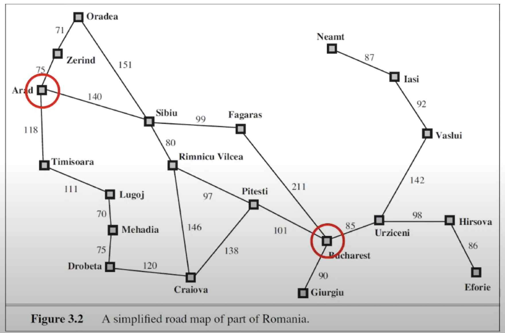

## Search in AI 
### Uniform Cost Search 



**[code](./ai-example/uniform-cost-search.py)**
```
The way I implemented is through a class for practice, but it can also be implemented in a single function
```
