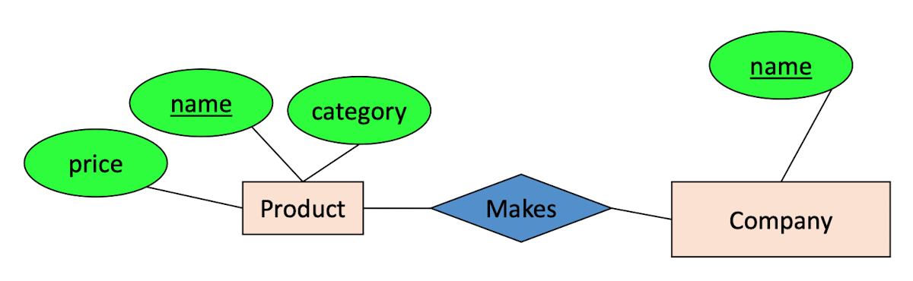
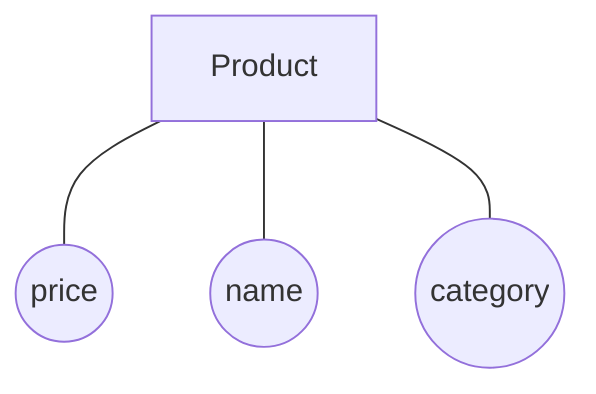
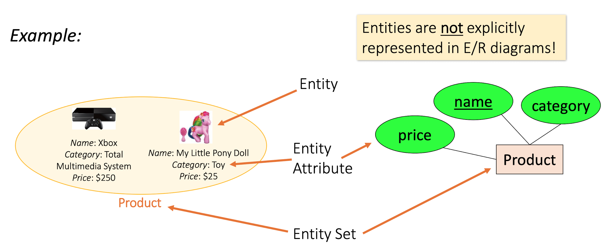
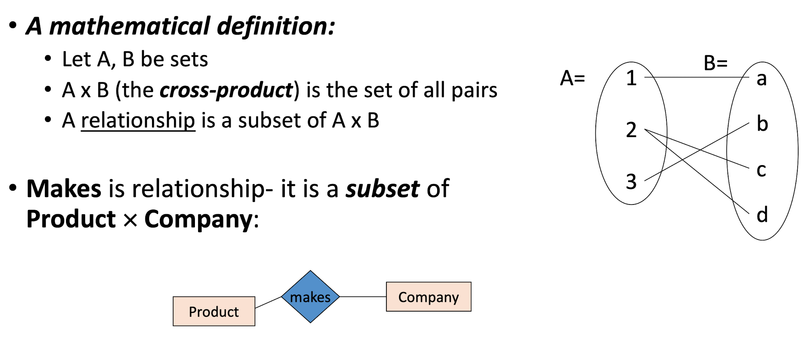
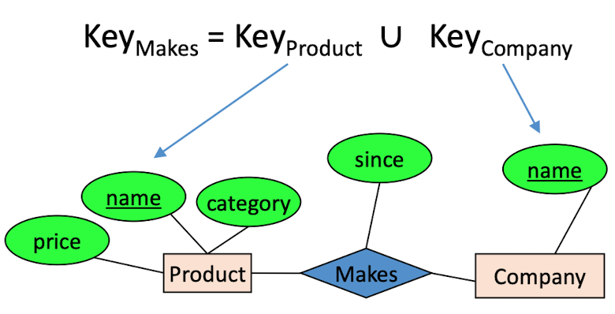
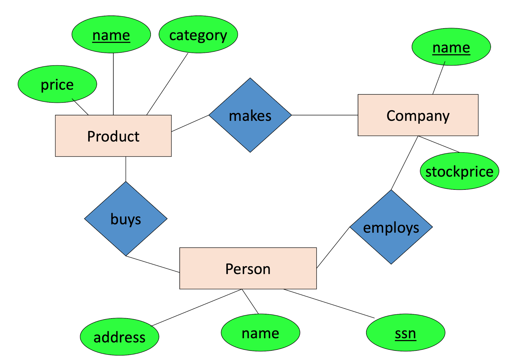
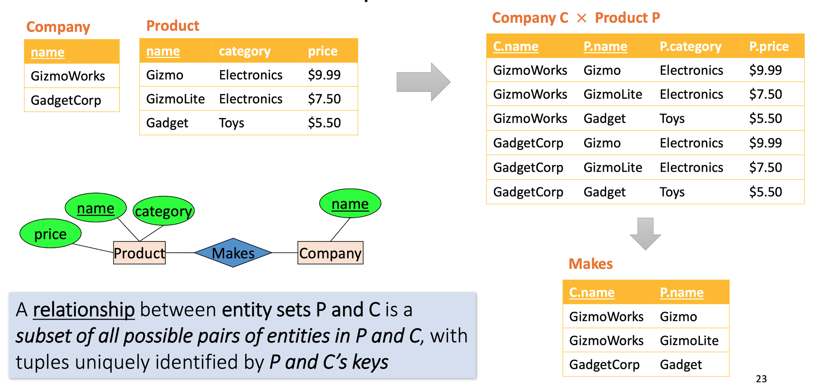
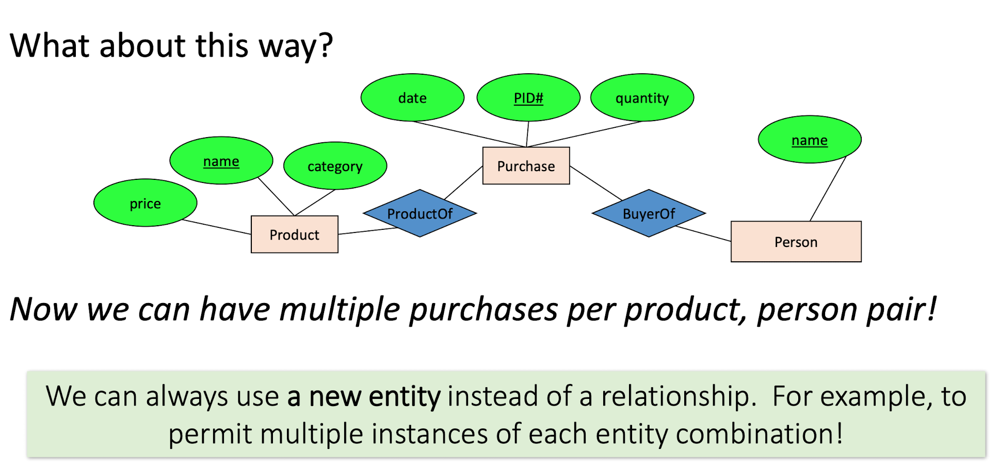

# Entities & Relations 

### E/R Design

#### [+] Why do we need it?
```
agree on structure of the database before deciding on a particular implementation 
         -------------------------
```
#### [+] Database Design Process 
##### &#x266f; Requirements analysis 
```
1) What is going to be stored?
2) How is it going to be used?
3) What are we going to do with the data?
4) Who should access the data?
```
##### &#x266f; Conceptual Design 
```
• A high-level description of the database 
    ----------------------
• Suffiently precise that technical people can understand it 
             -------
• but, not so precise that non-technical people can't participate 
       -----------------------------------------------------------
```

##### &#x266f; Logical, Physical, etc

### E/R Basics

<details><summary style=font-size:14px>E/R Model & Diagrams used all three DB design process above</summary>

</details>

```
E/R is a visual syntax for DB design which is precise enough for technical points
but abstract enough for non-technical
```

#### [+] Entities and Entity Sets
```
• Entities & Entity sets are the primitive unit of the E/R model 


1) Entity
individual objects, which are members of entity sets 

    + Product: iPhone, MacBook, iPad, etc
    + person:  Spike, Jet, Faye, Ed, Ein


2) Entity Set (class or types of objects)
    + Perdon, Product 
    + These are what is shown in E/R diagrams - as rectangles
    + Entity sets represent the sets of all possible entities

        ----------         -----------
        | Person |         | Product |
        ----------         -----------
             ^                  ^
             |                  |
        belongs to          belongs to
        /    |    \        /     |    \
    Spike   Jet  ...    iPhone  iPad  MacBook
```
##### &#x266f; attributes 
```
• represented by ovals attached to an entity set (shapes are important, colors are not)
                                                  ------------------------------------
```



##### &#x266f; Keys
```
A key is a minimal set of attributes that uniquely identifies an entity 
           -------

-> E/R model forces us to designate a single primary key, though there may be multiple candidate keys
```
#### [+] Relationship (is a subset)
##### &#x266f; mathematical definition
```
1) A relationship between entity sets P and C is a subset of all possible pairs of entities in P and C,
   with tuples uniquely identified by P and C's keys

2) There can only be one relationship for every unique combination of entities

3) This also means that relationship is uniquely determined by the keys of its entities
```




<details><summary style=font-size:14px>Key<sub>(Makes)</sub> = Key<sub>(Product)</sub> U key<sub>Company</sub></summary>

</details>

<details><summary style=font-size:14px>relationship example</summary>

</details>

##### &#x266f; example 


##### &#x266f; Relationship's Attributes
```
Q: What does Prodcut - Person relationship says?

A: a person can only buy a specific product once (on one date)

E: because modeling something as a relationship makes it unique; but it's inappropriate in this case
```


##### &#x266f; Football Example

#### [+] Relationships Multiplicity (Multi-way)


### E/R Design Considerations
