# conda sqlite
```
>> conda actiavte "env"
>> conda install -c conda-forge ipython-sql
```


# Database Management System (DBMS)

### Basic Goals
```
[1] collect & store
[2] efficiently query 
[3] safely update
[4] design trade-offs
```

### Basic Concepts
#### [+] Definition
```
1) A large, integrated collection of data

2) Models a real-world enterprise

    + Entities (e.g. students, courses)
    + Relationships (e.g. Chris is enrolled in course 145) 

3) a piece of software designed to store and manage databases


                  ---                                               ---
    Students        |                          who takes what         |
    Courses         |-- Entities                                      |-- Relationships
    Professors      |                          who teaches what       |
                  ---                                               ---
```

#### [+] Data Model 
```
A data model is a collection of concepts for describing databases 
    
    + The relational model of data is the most widely used model today 
    + relation table
```

#### [+] Schema 
```
A schema is a description of a particular collection of data, using the given data model 

    + every relation in a relational data model has a schema describing types
```

##### &#x266f; Logical Schema
```
Logical Schema 
    
    + Students  (sid: string, name: string, gpa: float)
    + Courses   (cid: string, cname: string, credits: int)
    + Enrolled  (sid: string, cid: string, grade: string)

    --------------------                                          -------------------------
    | sid | Name | gpa |                                          | cid | cname | credits |
    |-----|------|-----|                                          |-----|-------|---------|
    | 101 | Bob  | 3.2 |                                          | 564 | 564-2 |    4    |
    |-----|------|-----|                                          |-----|-------|---------|
    | 123 | Mary | 3.8 |            Corresponding Keys            | 308 | 417   |    2    |
    --------------------                                          -------------------------
      ^  Students                        Enrolled                   ^       Courses
      |                            ---------------------            |
      |                            | sid | cid | Grade |            |
      |                            |-----|-----|-------|            |
      |_________________________   | 123 | 564 |   A   |            |
                                   ---------------------            |
                                            |                       |
                                            |_______________________|

```

##### &#x266f; Physical Schema 
```
1) Administrator Level 
2) describe data layout 
    + Relations as unordered files
    + Some data in sorted order (index)
```

##### &#x266f; External Schema 
```
1) Application Level
2) Views
    + course_info (cid: string, enrollment: integer)
    + Derived from other tables
```

#### [+] Data Independence 
```
Applications do not need to worry about how the data is structure and stored 
```
##### &#x266f; Logical Data Independence
```
Don't ask can we add a new entity or attribute without rewriting the applications 
: you can

>> protection from changes in the logical structure of the data
```
##### &#x266f; Physical Data Independence
```
Don't ask which disks are the data stored on? Is the data indexed?
: you don't need to know 

>> protection from physical layout changes
```

#### [+] Key Concepts (challenges)
##### &#x266f; Transaction & Atomicity 
```
1) Transaction (TXN): an atomic sequence of database actions (reads/writes)

2) Atomicity: an action either completes entirely or not at all
                                         --------    ----------

ex).                        _________________________________
Acct  |  Balance            |                               |              Acct  |  Balance 
----------------            | Transfer $3K from a10 to a20: |              ----------------
a10   |  20,000      -->    | 1. Debit $3k from a10         |    -->        a10  | 17,000
a20   |  15,000             | 2. Credit $3k to a20          |               a20  | 18,000
                            |_______________________________|
                                          (TXN)
                        

!! cautions: 
all instruction in the box is a TXN, while crash of DB could happen either 

    + before 1 
    + after 1 but before 2 
    + after 2 

because the properties of atomicity, 
whichever stage crash happen TXN result in not complete at all 
```
##### &#x266f; Consistency 
```
1) An action results in a state which conforms to all integrity constraints

2) integrity constraints: 
> each course is assigned to exactly one room

3) Transactions leave the DB in a consistent state 
> however, note that DBMS does not understand the real meaning of the constraints consistency 
> burden is still on the user
```
##### &#x266f; Locking (concurrency)
```
1) DBMS ensures that the execution of {T1, ... ,Tn} is equivalent to some serial execution 


2) Locking:
> before reading or writing, 
> transaction requires a lock from DBMS, holds until the end


3) If Ti wants to write to an item x and Tj wants to read x, then Ti, Tj conflict
> Solution via locking: 
    + only one winner gets the lock 
    + loser is blocked (waits) until winner finishes


4) Write-ahead Logging (WAL)
> keep a log of all the writes done 
> after a crash, the partially executed TXNs are undone using the log
```
### Relational Model
```
1) Relational Model is a precise, implementable procedural representation 
2) We can operate on it, and database maps internally into this procedural language
```
#### [+] Relational Schema 
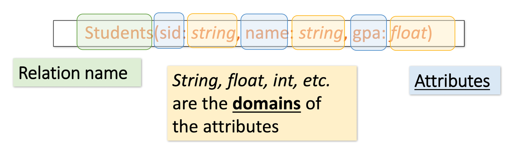
<br>

```
A relational schema describes the data that is contained in a relational instance
```
#### [+] Relational Instance (Data)
```
A relational instance is a set of tuples(rows) all conforming to the same schema
```
##### &#x266f; Columns
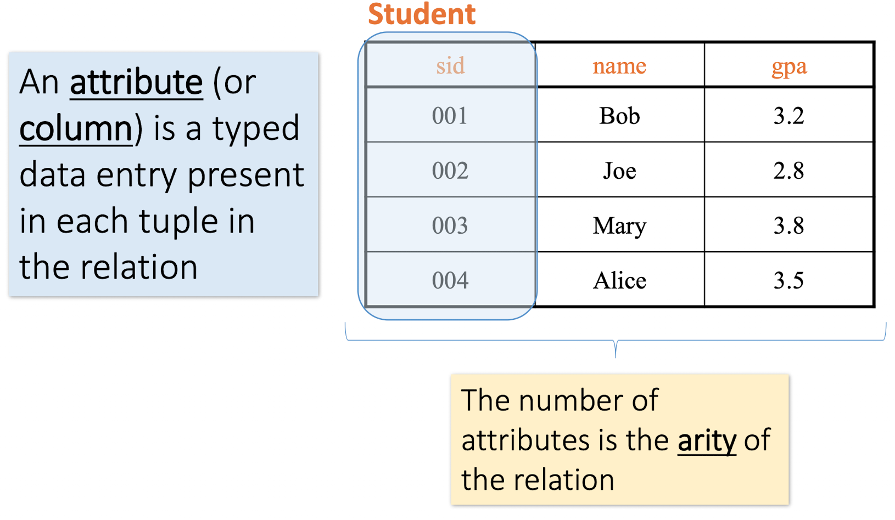
<br> 

##### &#x266f; Rows
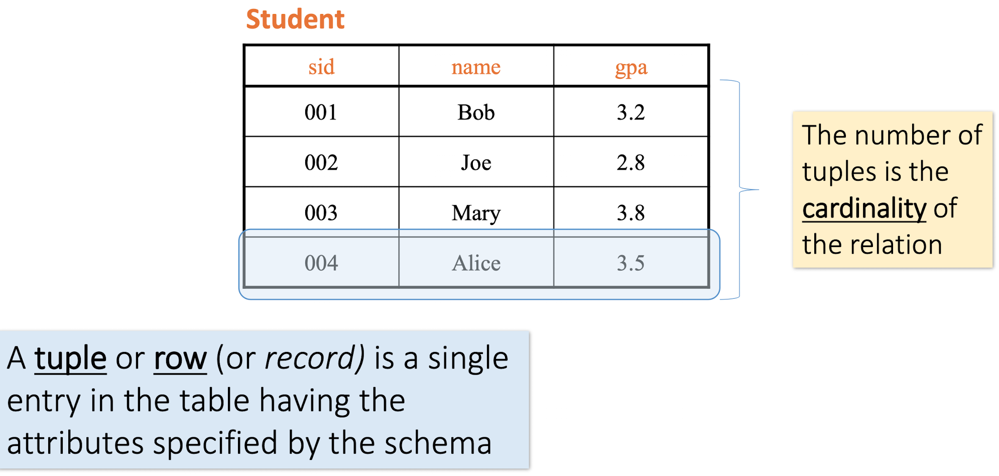
<br>

```
Relational Algebra allows us to translate declarative (SQL) queries into precise and optimizable expressions
```
### Algebra 
```
simple version: operators and atomic operands (操作数)
```
```
1) A language based on operators and a domain of values. 
   Operators map values taken from the domain into other domain values.

2) When the domain is a set of all relations (and the operators are as described later),
   we get the relational algebra

3) We refer to the expression as a query and the value produced as the query result
```
#### [+] Arithmetic Algebra
```
1) operands are variables and constants
2) operators are the usual arithmetic operators 
ex).
(x+y)*2 or ((x+7)/(y-3)) + x
```
#### [+] Relational Algebra 
```
[!] Domain: set of relations -> relation = table 


[!] work flow:
                       ----------------
    -------------      | Relational   |      ---------------------      -------------
    | SQL Query |  ->  | Algebra (RA) |  ->  | Optimized RA Plan |  ->  | Execution |
    -------------      | Plan         |      ---------------------      -------------
                       ----------------
      declarive         translate to            find locally             Execute each
        query           RA expression           equivalent-but           operator of the 
                                                more efficient-RA        optimized plan
                                                expression

1) operands are variables that stand for relations and relations (sets of tuples)
2) RA operates on sets(multisets)
3) every attribute must have a unique name 
```
##### &#x266f; Operations
```
1) Basic Operators (5)
   > select 
   > project  
   > union 
   > set difference
   > Cartesian product (cross product)
   
2) Derived Operators
   > intersection, complement
   > renaming: p
   > join (natural, equi-join, theta join)
```
##### &#x266f; Classfication 
```
1) Operations that remove parts of relations:
    + selection 
    + project 

2) Operations that combine tuples from two relations:
    + Cartesian product
    + join 

3) Since each operation returns a relation 
    + operations can be composed
```

#### [+] Relational Query Languages 
```
Language for describing queries on a relational database 
```
##### &#x266f; Structured Query Language (SQL)
```
1) Predominant application-level query language 
2) Declarative 
```
##### &#x266f; Relational Algebra 
```
1) Intermediate language used within DBMS 
2) Procedural 
```
### RA Operators
#### [+] Select Operator
##### &#x03ec;<sub>condition</sub>(relation)
```
produce table containing subset of rows of argument table satisfying condition
                         --------------
```

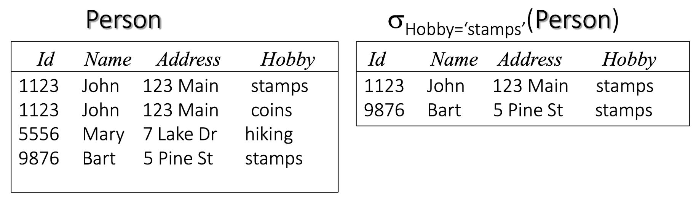
<br>

##### &#x266f; Selection Condition 
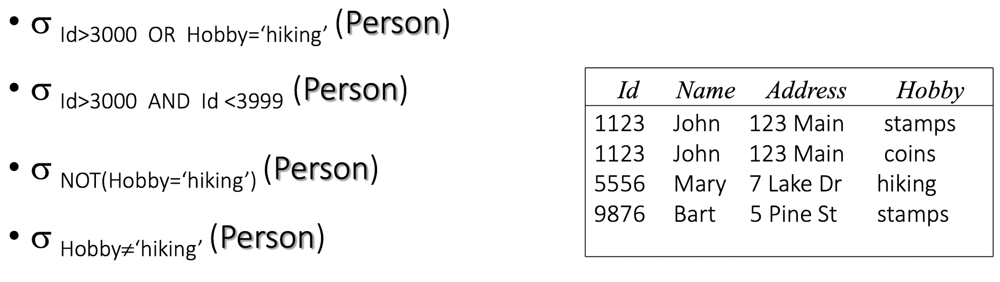

#### [+] Project Operator 
##### &#x03c0;<sub>attribute_list</sub>(relation)
```
Produces table containing subset of columns of argument table
                          -----------------
```

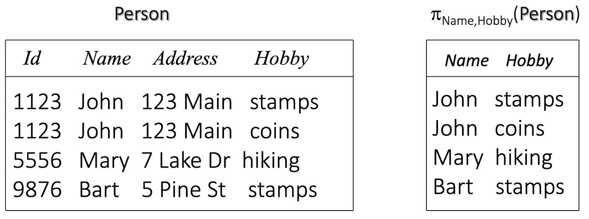

```
result is a table(relation) with no duplicates, it can have fewer tuples than the original
```

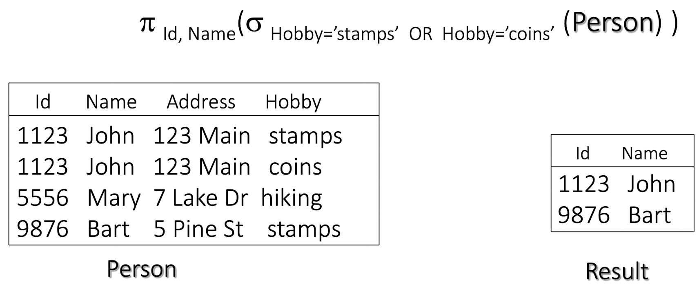

#### [+] Set Operator 

*Relation is a set of tuples, so set operations should apple: **&#x2229;, U,** ---(set different)*
```
1) result of combining two relations with a set operator is a relation => 
   all its elements msut be tuples having same structure 

2) meaning length of rows and columns must be the same, atrributes must be the same

3) Hence, scope of set operations limited to union compatible relations 
                                             --------------------------
```
##### &#x266f; Union Compatible Relations 
```
Two relations are union compatible if 
    1) both have same number of columns 
    2) Names of atrributes are the same in both 
    3) Attributes with the same name in both relations have the same domain

reiterate: 
+ union compatible relations can be combined using union, intersection and set difference
```

##### &#x266f; Example 
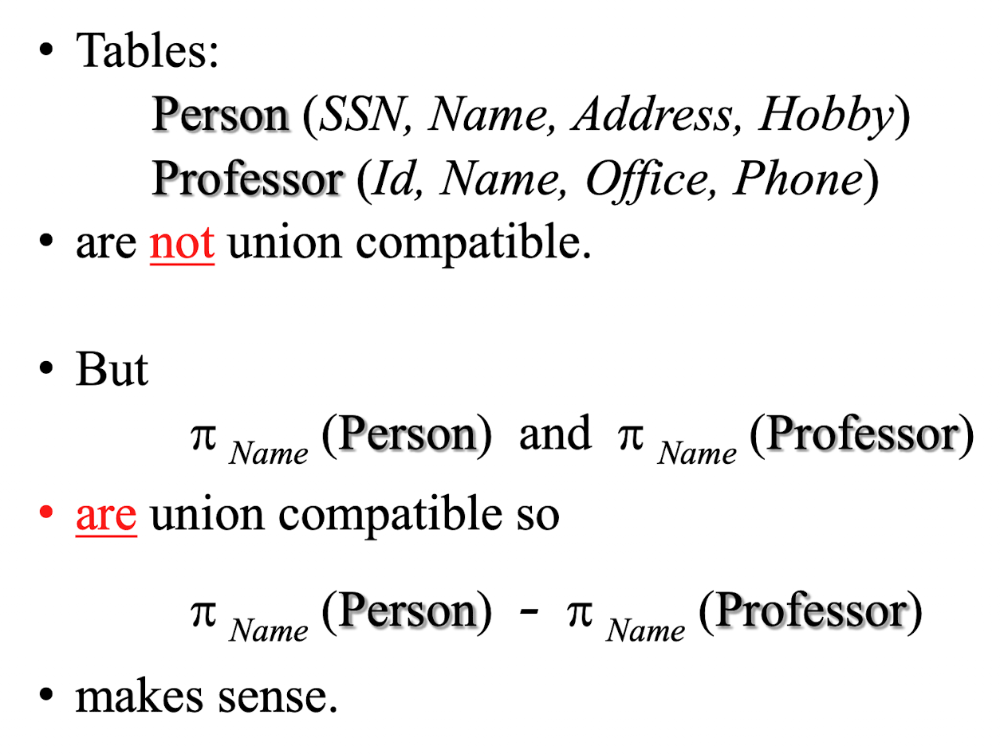


#### [+] Cartesian Product 
```
If R and S are two relations, R x S is the set of all concantenated tuples <x, y> 
where x is a tuple in R and y is a tuple in S

1) R and S need not be union compatible 
2) but they must have distinct attribute names
|
3) Attributes of relation must have distinct names, which is not guranteed with Cartesian product
```
##### &#x266f; Compute
```
expensive to compute
```

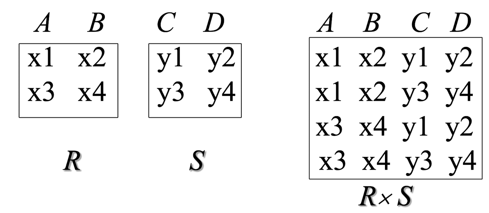

##### &#x266f; Renaming 
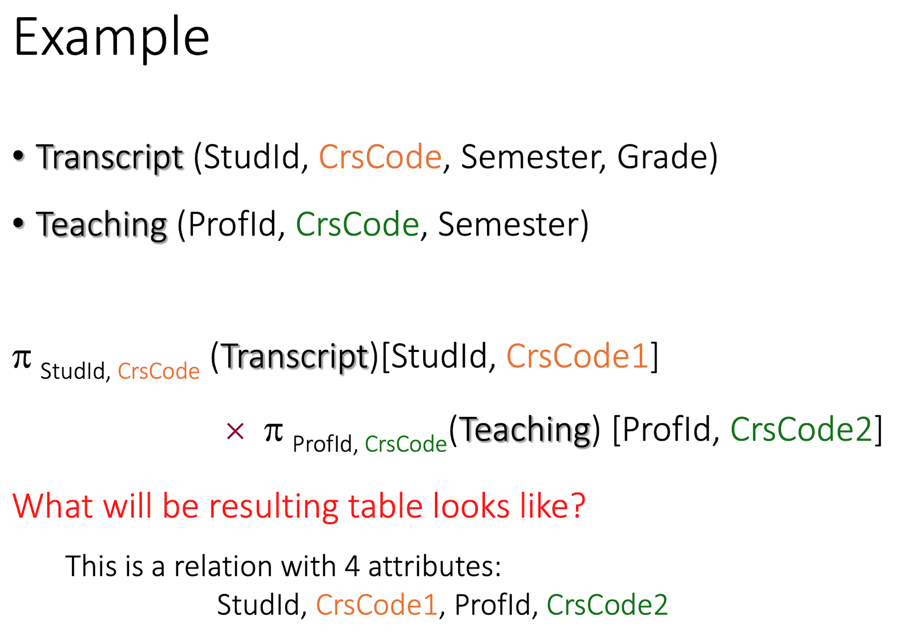

#### [+] Union ( U )

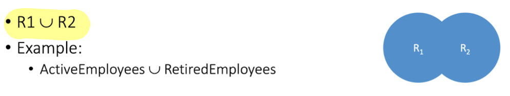

```
Two relations could have common tuples, but no nessarily
```
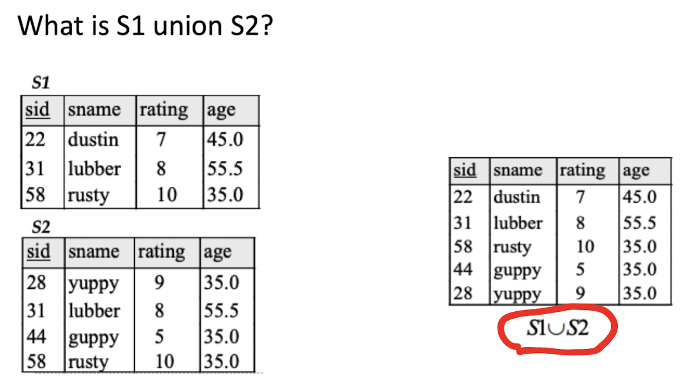

#### [+] Difference ( -- )


```
deduct the part belongs to R2 from R1, or reserve
```
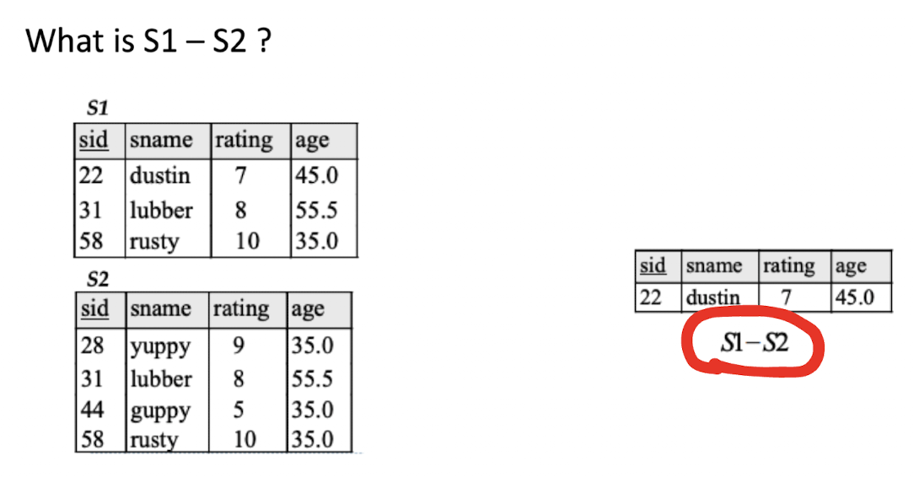

#### [+] Intersection ( &#x2229; )
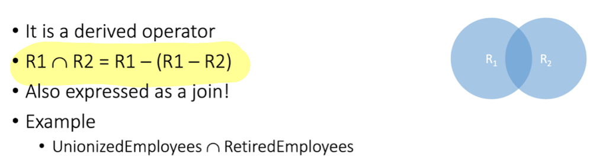

```
the common part both R1 and R2 have
```
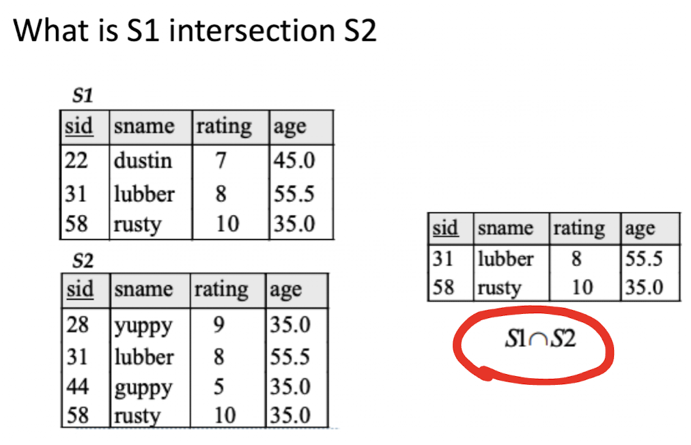

#### [+] Cartesian-Product Operation 
##### &#x266f; Notation: r x s
```
defined as:
r x s = {t q | t ∈ r and q ∈ s}, t, q are rows in r and s 

1) assume that attributes of r(R) and s(S) are disjoint (That is, R ∩ S = ∅)
2) if attributes of r(R) and s(S) are not disjoint, then renaming must be used
```
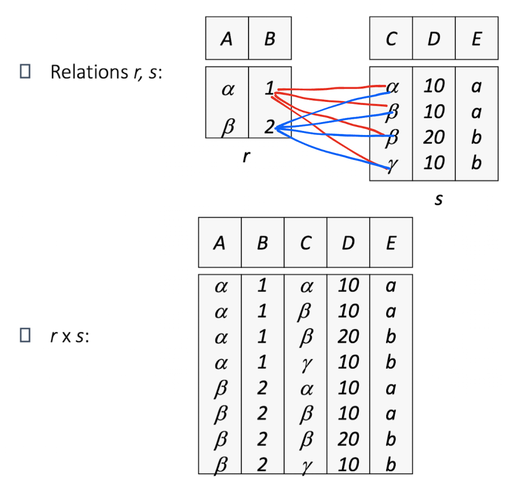

##### &#x266f; **&#x03ec;**<sub>A=C</sub>(r x s)
```
select rows where the value of A = C
```
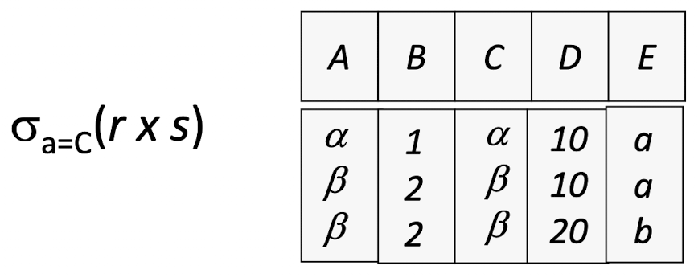

#### [+] Join 
##### &#x266f; Cartesina Product (could)= "join"
```
benefit: 
+ taking Cartesian prodcut of two relations give us all the possible tuples that are paired together

donwside:
- not efficient when huge relations with thousands of tuples that having large amount of attributes
```


##### &#x266f; Mental Presentation (attribute level)
```
1) join operates at attribute(row) level, 
2) all attributes from two table will be collected together 
   as the attributes list for the newly combined table
3) if there are attributes with the same name, renaming is needed

-------------------------------------------------
| attribute 1 | attribute 2 | ... | attribute n |
-------------------------------------------------
.
.
.

```

##### &#x266f; Theta Join 
```
• allows for arbitrary comparision relationship (such as >, < and =)
  => natural join with conditions

student                         Subject 
____________________            ___________________
| SID | Name | Std |            | Class | Subject |
|-----|------|-----|            |-------|---------|
| 101 | Alex |  10 |            |   10  |   Math  |
| 102 | Lucy |  11 |            |-------|---------|
--------------------            |   10  | English |
                                |-------|---------|
                                |   11  |  Music  |
                                |-------|---------|
                                |   11  |  Sport  |
                                -------------------
```
**theta(θ) join:** STUDENT ⋈ <sub>Student.Std = Subject.Class</sub> SUBJECT 
```
result: 

Std = Class, so all the values are equal, there are just different attribute name
------------------------------------------------
|  SID  |  Name  |  Std  |  Class  |  Subject  |
|-------|--------|-------|---------|-----------|
|  101  |  Alex  |   10  |    10   |    Math   |
|-------|--------|-------|---------|-----------|
|  101  |  Alex  |   10  |    10   |  English  |
|-------|--------|-------|---------|-----------|
|  102  |  Lucy  |   11  |    11   |   Music   |
|-------|--------|-------|---------|-----------|
|  102  |  Lucy  |   11  |    11   |  Sports   |
------------------------------------------------

```
###### &#x266f; Another Example
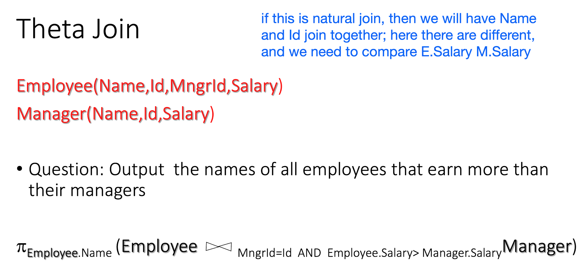

##### &#x266f; Equijoin 
```
above example actually could be regarded as an equijoin
```

##### &#x266f; Natrual Join 
```
1) an equijoin on attributes(at least one) that have the same name in each relationship 
2) additionally, natrual join removes the duplicate columns 
   involved in the equality comparison so only 1 of each compared column remains


R = (a, B, C, D) 
S = (E, B, D)

• Result schema = (a, B, C, D, E)
• r ⋈ s is defined as:
```
**&#x03c0;**<sub>r.a, r.B, r.C, r.D, r.E</sub>(**&#x03ec;**<sub>r.B=s.B ∧ r.D=s.D</sub>(r x s))

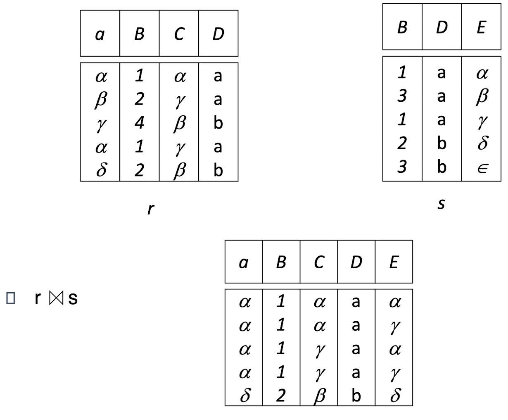

```
---------------------------------------------------------------------------------------------
| 1) cross-product (cartesian product) of r and s                                           |
| 2) since both relations have attributes B and C, choose rows where r.B = s.B & r.D = s.D  |
|                                                                                           |
| 3) Must have at least one same attribute name in both tables(relations) for natural join  |
---------------------------------------------------------------------------------------------
```

### Examples for RA query
```
+ Natural Join could combine different attributes into one relations 
+ building connection between all attributes from one table and all attributes from the other table
```
##### &#x266f; solution steps 
```
1) what will be in the result ? 
2) which table give us what from 1) ?
3) conditions ?
4) which table give us the conditions ?
```
#### 1) Sample Query
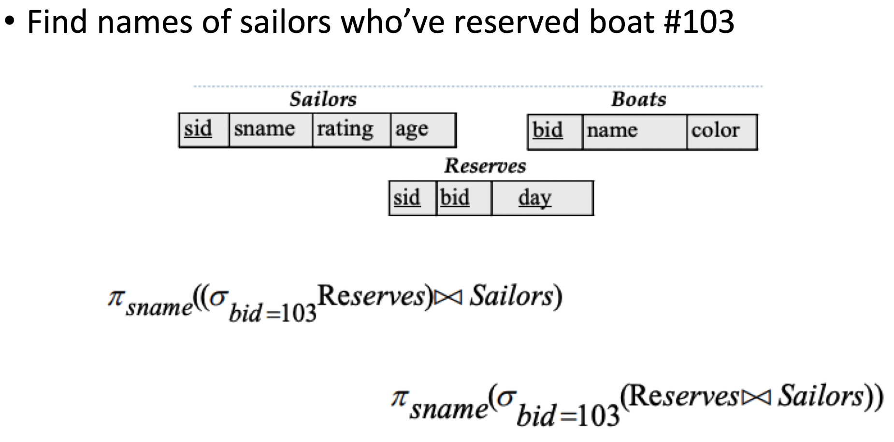

```
1) sname 
2) saliors give sname 
3) bid = #103
4) boats and reserves (the connection we need to build [sname ~ bid])
```

#### 2) Sample Query
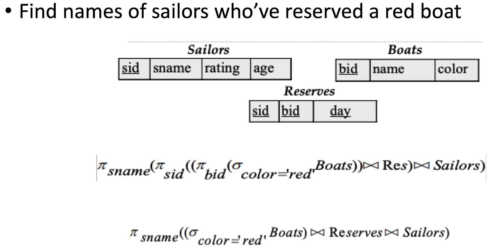

```
1) sname 
2) saliors give sname 
3) color = red 
4) boats, reserves and sailor (connection we need to build is sname ~ color)
```
*Answer:* π<sub>sname</sub>((Ϭ<sub>color='red'</sub>Boats) ⋈ Reserves ⋈ Salior)

#### 3) Sample Query
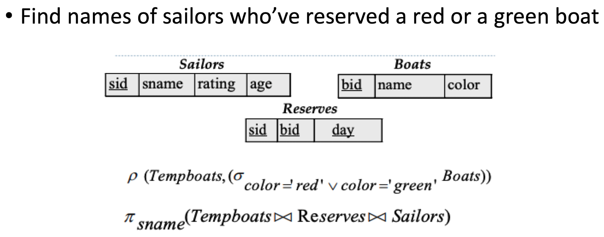

```
1) sname 
2) salior 
3) color = 'red' or 'green'
4) sailors, boats and reserves

same logic as query2, but but here introduce a new way of construct query 
```
**create temporary relation:** ⍴(Tempboats, (Ϭ<sub>color='red' ⋁ color='green'</sub>Boats)) <br>
**Final Answer:** π<sub>sname</sub>(Tempboats ⋈ Reserves ⋈ Sailors)

#### 4) Sample Query
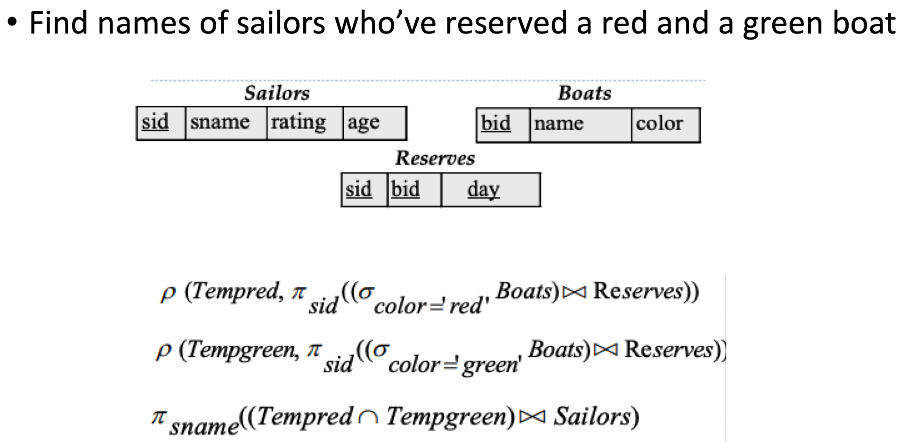

```
same logic, but using "and" operator
```

**saliors who reserve red boat:**   ⍴(Tempred, π<sub>sid</sub>(Ϭ<sub>color='red'</sub>Boats ⋈ Reserves)) <br>
**saliors who reserve green boat:** ⍴(Tempgreen, π<sub>sid</sub>(Ϭ<sub>color='green'</sub>Boats ⋈ Reserves)) <br>
**intersect them(because both red and green at the same time):** π<sub>sname</sub>((Tempred ⋂ Tempgreen) ⋈ Sailors)


#### 5) Sample Query
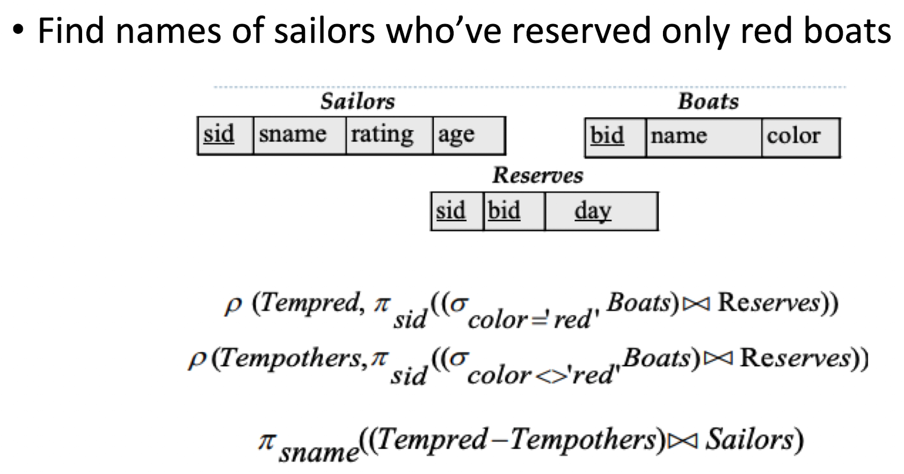

```
in the query 4 logic: 
when asking who reserve red boat 
the sailor we found could not only have red boat reserved but other colors as well

<>: negation
```
**saliors who reserve red boat:** ⍴(Tempred, π<sub>sid</sub>(Ϭ<sub>color='red'</sub>Boats ⋈ Reserves)) <br>
**saliors who reserve other color boats but not red:** ⍴(Tempothers, π<sub>sid</sub>(Ϭ<sub>color=<>'red'</sub>Boats ⋈ Reserves)) <br>
**salior reserve red and other colors - who reserve other color except red: <br>**
π<sub>sname</sub>((Tempred - Tempother) ⋈ Sailors)

#### 6) Self Join (natural join)
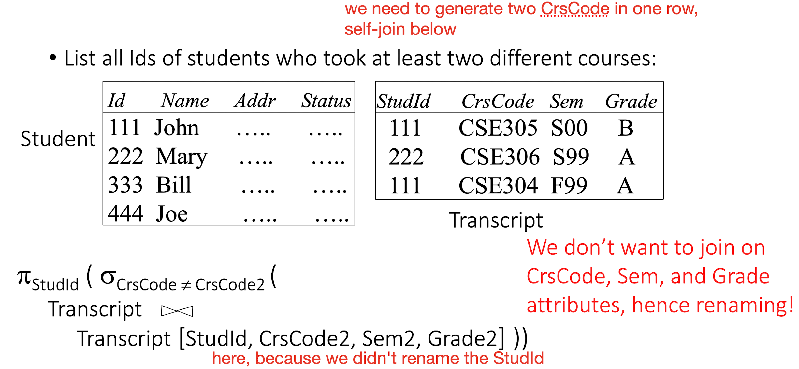

#### 7) Practice: find maximum


# SQL & schema definitions

### why SQL?
```
Find all bars that sell beers above $2.5 

sells 
----------------------------
|  bar  |  beer  |  price  |
|---------------------------
| Joe's |   Bud  |   2.50  |
|-------|--------|---------|
| Joe's | Miller |   2.75  |
|-------|--------|---------|
| Sue's |   Bud  |   2.50  |
|-------|--------|---------|
| Joe's |  Coors |   2.50  |
----------------------------

PROJECT bar (SELECT price > 2.5 Sells)

--------------------------------------------------------------------------------------------
reason to use SQL 
1) may be hard for ordinary programmers to write (especially when the query becomes complex)

2) better devise a query language that is more "English", more understandable

3) A SQL query can be translated into a RA expression
```

### Definition 

#### [+] SQL (Structured Query Language)
```
very high-level programming language, every SQL will be optimized before execution
```
#### [+] Data Definition Language (DDL)
```
+ define relational schemata 
+ create/alter/delete tables 
```
#### [+] Data Manipulation Language (DML)
```
+ Insert/delete/modify tuples in tables 
+ Query one or more tables
```
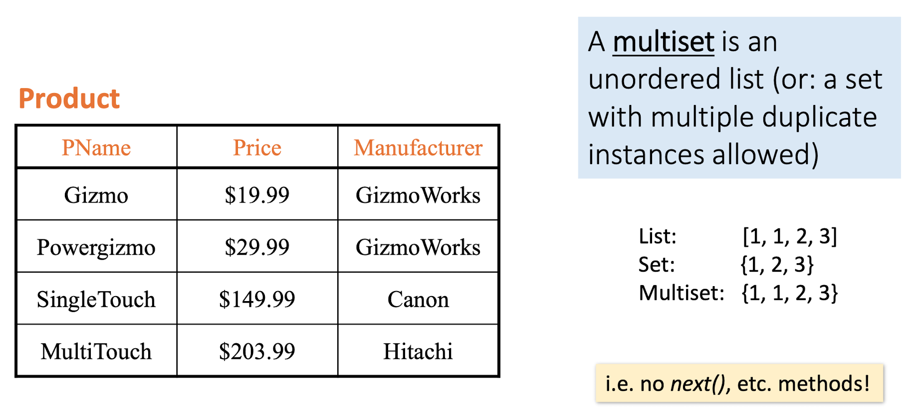

```
1) Attributes must have an atomic type in standard SQL (not a list, set, etc)
                           ------

2) Atomic type 
    • Boolean 
    • Numbers:   INT, BIBINT, SMALLINT, FLOAT
    • Character: CHAR(20), VARCHAR(50)
    • Others:    MONEY, DATETIME

3) The number of attributes is the arity of the relation 
                                   -----
                                must be unique
```

#### [+] Table Schemas 
```
1) The schema of a table is the table name, its attributes, and their types 

--------------------------------------------------------------------------------
|   Product(Pname:string, Price:float, Category:string, Manufacturer:string)   |
--------------------------------------------------------------------------------

2) A key is an atrribute whose values are unique; we underline a key 

---------------------------------------------------------------------------------
|   Product(Pname:string, Price:float, Category:string, Manufacturer:string)    |
|           -----                                       ------------            |
|                                                                               |
---------------------------------------------------------------------------------
```


#### [+] Key Constraints 
```
A key is a minimal subset of attributes that acts as a unique identifier for tuples in a relation

1) lots of attributes 
   minimal subset of attributes mean that key should have at least one attribute

2) unique identifier for tuples
```

##### &#x266f; NULL & NOT NULL
| sid | name | gap
| --- | --- | --- |
| 123 | Bob | 3.9 |
| 143 | Jim | NULL|
```
1) to say "don't know the value" we use NULL
   say, Jim just enrorlled in his first class 

2) In SQL, we may constrain a column to be NOT NULL, for example "name" in this table can't be unknown
```

##### &#x23f5; General Constraints 
```
In theory, we can specify as many arbitrary constraints as possible 

but we don't do that, because Performance!
------------------------------------------
whenever we do something ugly (or avoid doing something convenient) it's for the sake of performance
```
#### [+] Summary 
```
Schema and Constraints are useful for optimization
```

# Single-table queries 

#### [+] renaming 
```
If you want the result to have different attribute names, use "AS <new name>" to rename

table:
Beers(name, manf)
-----------------
SELECT name AS beer, manf 
FROM Beers 
WHERE manf = 'Anheuser-Busch'
```

#### [+] NULL 
```
1) Tuples in SQL relations can have NULL as a value for one or more components 

    + Missing Value: we know Joe's Bar has some address, but we don't know what it is 
    + Inapplicable:  the value of attribute spouse for an unmarried person

2) SQL will evaluate to TRUE only if it knows for *sure*
3) SQL will return only cases for which it evaluates to TRUE 

--------------------------------------------------------------------------------------------
ex.
(price < 2.00) OR (price >= 2.00)
(price >= 2.00)

intuitively, price could be less than 2.00, or greater or equal to 2.00 -> doesn't know for sure
```

##### &#x266f; Three-Valued Logic 
```
The logic of conditions in SQL is a 3-valued logic: 
1) TURE
2) FALSE 
3) UNKNOWN

• when any value is compared with NULL, the truth value is UNKNOWN 
  but query only produces a tuple in the answer if its truth value for the WHERE clause is TRUE
```

##### &#x266f; Three-valued logic Example 
```
1) TURE = 1 
2) FALSE = 2 
3) Unknown = 1/2 
-----------------
I)   AND = MIN 
II)  OR = MAX 
III) NOT(x) = 1-x 
-----------------

(age > 20) AND ((age < 10) OR NOT (price < 5))
                      |
                      V 
TRUE AND (FALSE OR NOT(Unknown)) = MIN(1, MAX(0, (1-1/2))) = MIN(1, MAX(0, 1/2)) = MIN(1, 1/2) = 1/2 = unknown


ex). From the Following Sells relation:

        ----------------------------
        |    bar    | beer | price |
        |-----------|------|-------|
        | Joe's bar | Bud  | NULL  |
        ----------------------------

        SELECT bar
        FROM Sells 
        WHERE price < 2.00 OR price >= 2.00 
              ------------    -------------
                unknown          unknown
             <----------------------------->
                         unknown
```

##### &#x266f; Testing for Null 
```
SELECT * FROM Person 
WHERE age < 25 OR age >= 25 OR age IS NULL 
      ---------------------    -----------
   won't include null value     Null value is included
```

#### [+] Constraints
```
1) NOT NULL 
2) DEFAULT 
3) UNIQUE 
4) CHECK 

constrain enforcement
---------------------------------------------
CREATE TABLE COMPANY(
    ID      INT  primary key NOT NULL,
    NAME    TEXT             NOT NULL,
    AGE     INT              NOT NULL UNIQUE,
    ADDRESS CHAR(50),
    SALARY  REAL             DEFAULT 50000.00
);
```

# Multi-table queries 
#### [+] Foreign key constraints 
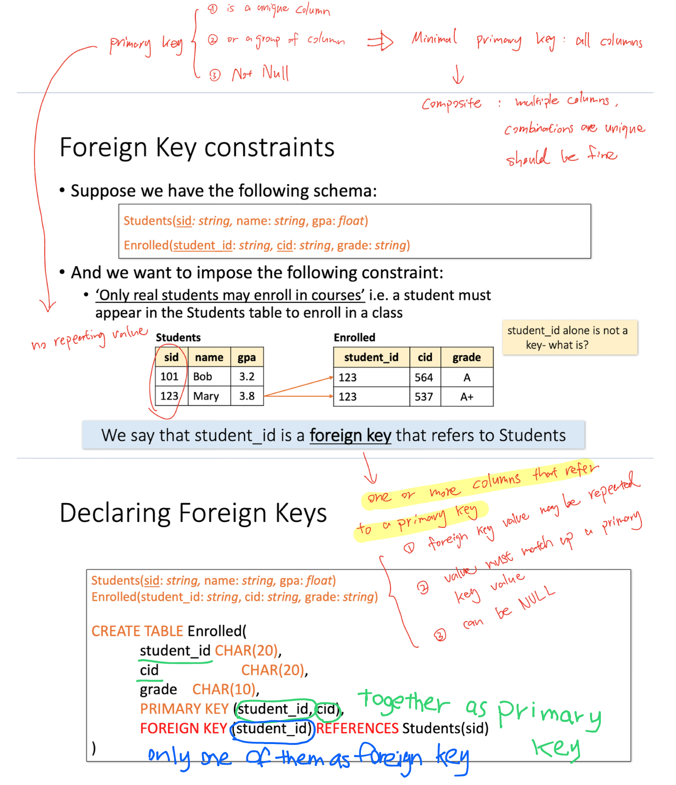

##### &#x23f5; Foreign Keys and update operations 
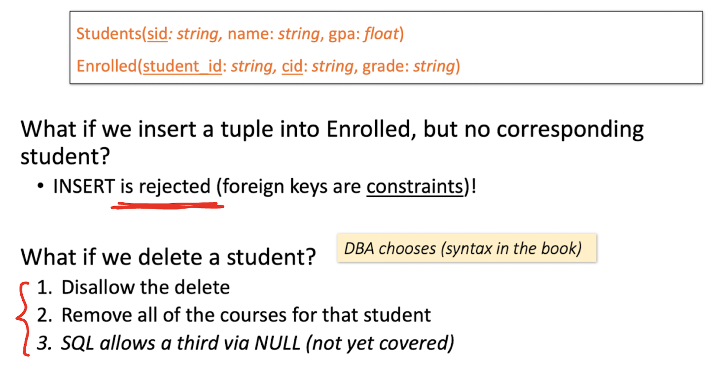

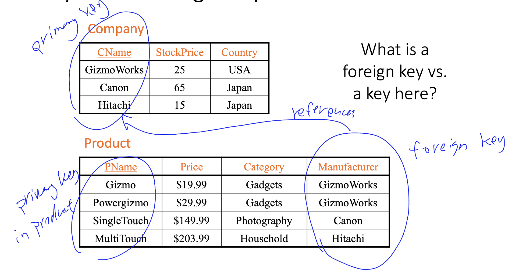

#### [+] Joins

##### &#x266f; Example 1 
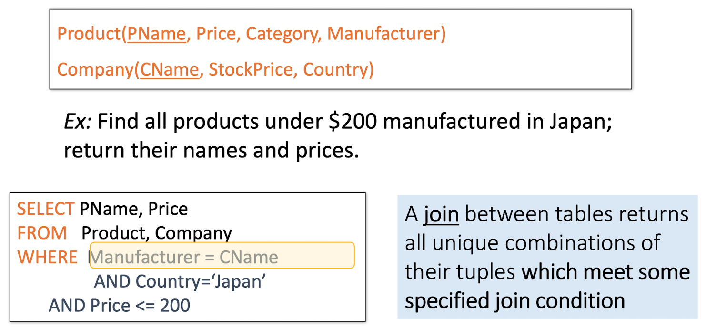

```
alternative way to write query 

(method 1)                                  (method 2)
SELECT PName, Price                         SELECT PName, Price 
FROM   Product, Company                     FROM   Product 
WHERE  Manufacturer = CName                 JOIN   Company On Manufacturer = 'CName' (foreign key)
AND    Country = 'Japan'                    AND    Country = 'Japan'
AND    Price <= 200                         WHERE  Price <= 200

=================
I prefer method 1
```

##### &#x266f; Example 2
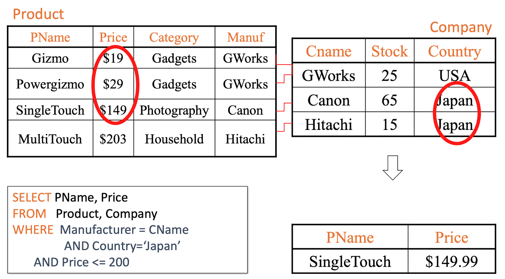

#### [+] Tuple Variable Ambiguity in Multi-Table 
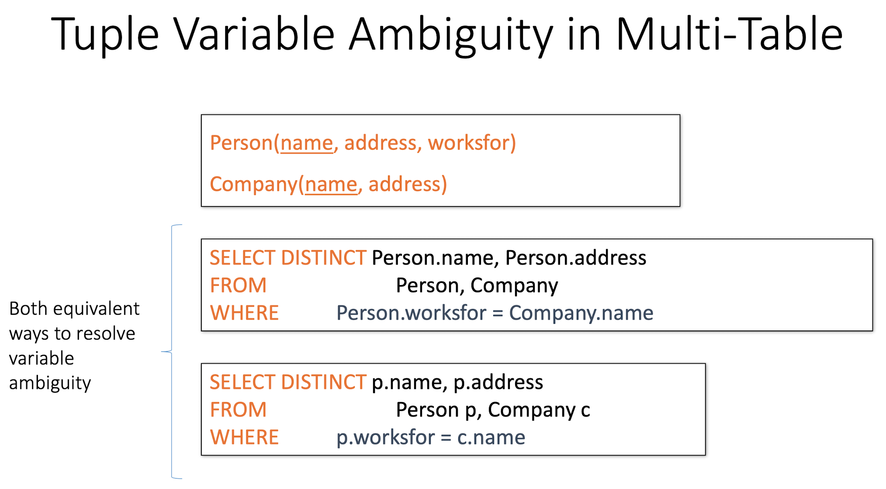

```
we cannot do this: 
-----------------------------
SELECT DISTINCT name, address 
FROM Person, Company 
WHERE worksfor = name 

which name and address are we refering?
```
#### [+] SQL semantics 
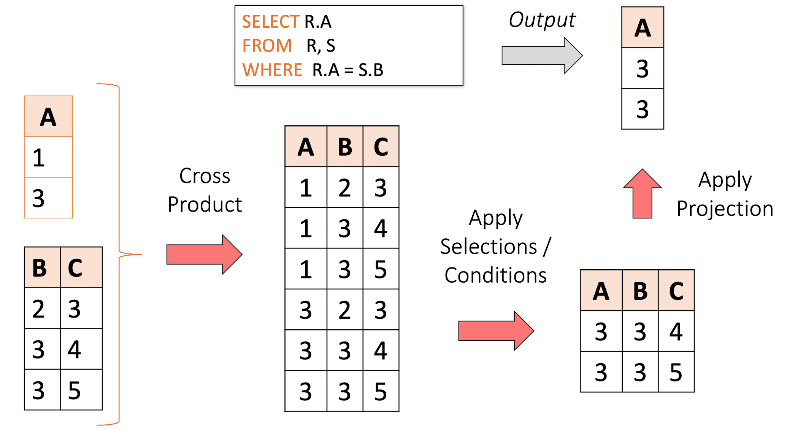
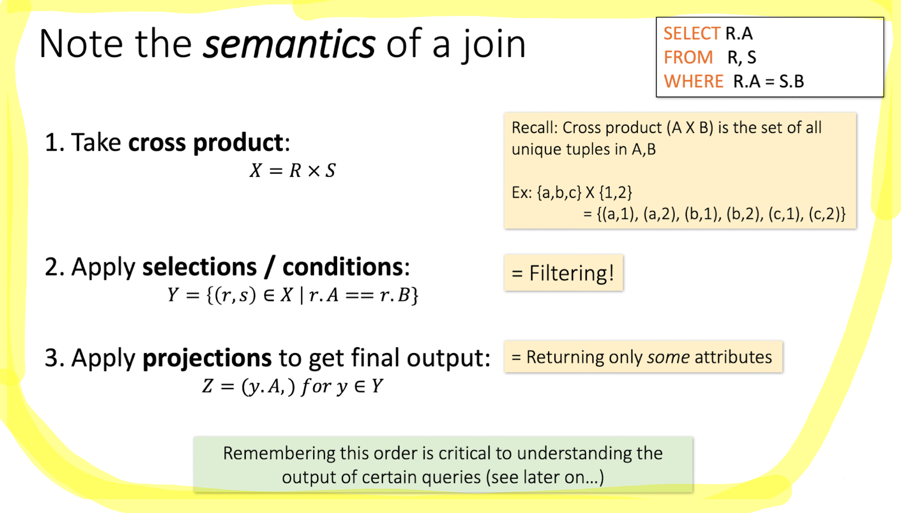

```
semantics ≠ execution order, DBMS executes command after optimization
```
##### &#x266f; Unintuitive Query for understanding why operating with ∅ will result in ∅ 
```

```

#### [+] Multiset Operations 
##### &#x23f5; Multisets 
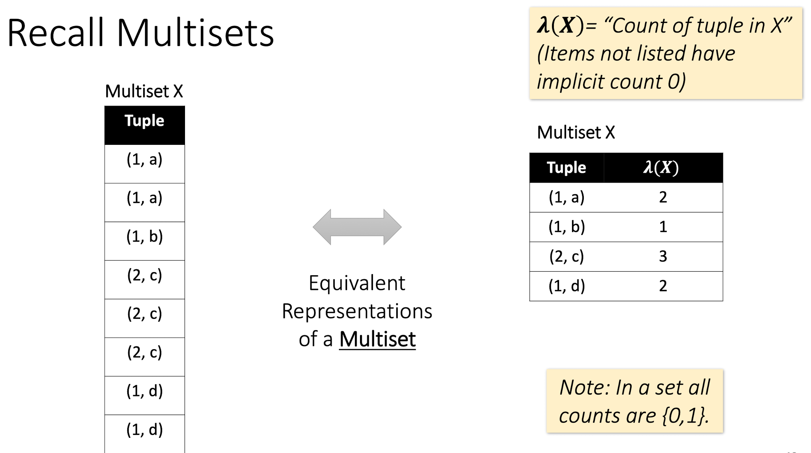
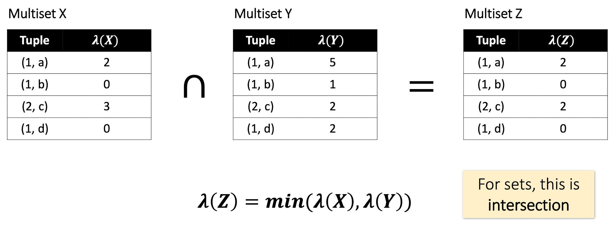
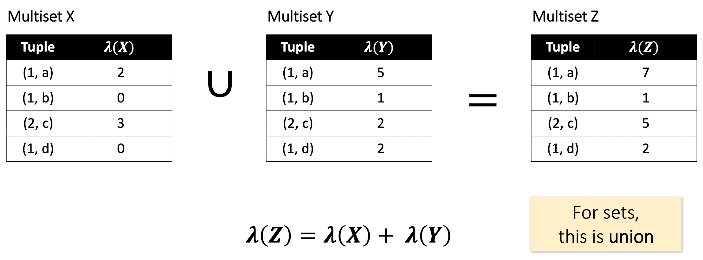

##### &#x266f; Multisets Operations
###### &#x266f; Intersect
```
SELECT R.A FROM R, S 
WHERE R.A = S.A 
INTERSECT 
SELECT R.A FROM R, T 
WHERE R.A = T.A
```
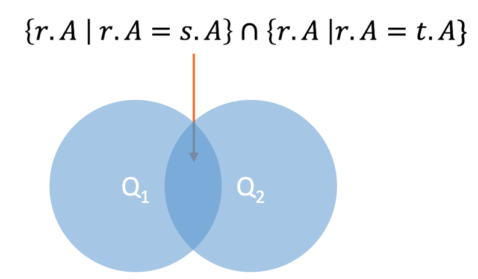

###### &#x266f; Union
```
SELECT R.A FROM R, S 
WHERE R.A = S.A 
UNION 
SELECT R.A FROM R, T 
FROM R, T
WHERE R.A = T.A

by default, SQL operator uses set semantics, so there aren't duplicate after single operation
```
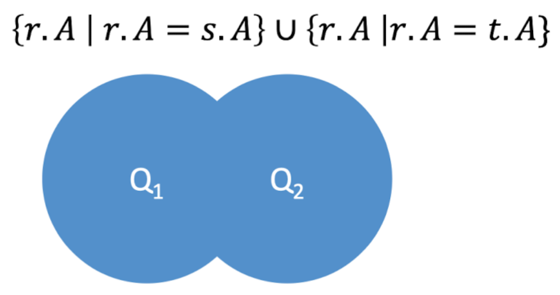

###### &#x266f; Union All
```
SELECT R.A FROM R, S 
WHERE R.A = S.A 
UNION ALL
SELECT R.A FROM R, T 
FROM R, T
WHERE R.A = T.A
```
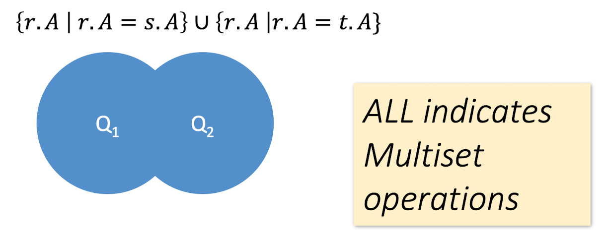

###### &#x266f; Except
```
EXCEPT (replace where above operator is)
```
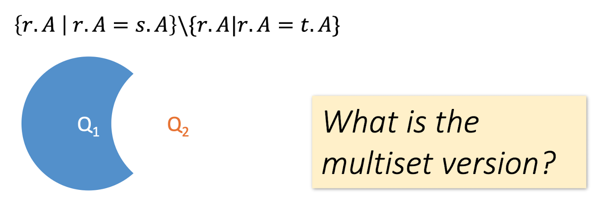

##### &#x266f; Issues with Intersect
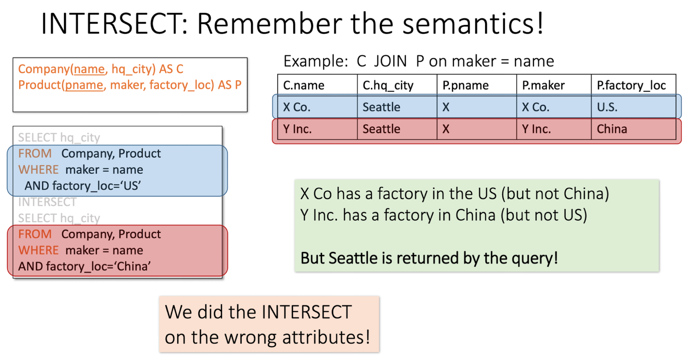

```
As the green background text indicates:
all companies with factories in the US will be return, so as those with factory in China 
but at the same time, companies that have company exclusively located in one place will be selected as well 

intuitively, we want to use intersect to meet the criteria, but in fact fail in this case
|
V 
introduce nexted queries for solving issues that require intersect operation logic
```
#### [+] Nested Queries
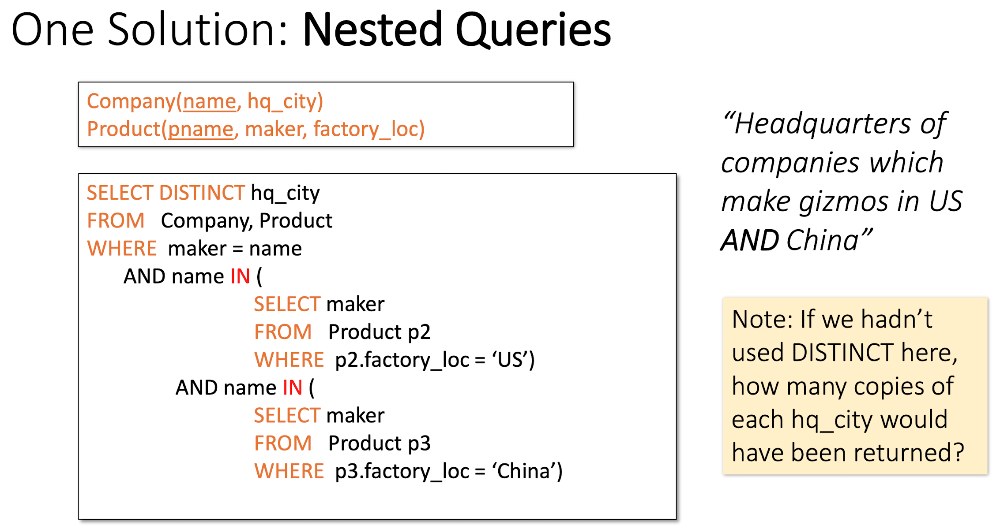

```
refer to those example in the slides
```

# Aggregation & Group By
#### [+] Aggregation Operator 
```
1) SUM 
2) COUNT 
3) MIN 
4) MAX 
5) AVG
```
##### &#x266f; COUNT

##### &#x266f; GROUP BY 

##### &#x266f; HAVING
```
1) HAVING clauses operate on aggregate condition (column level) 

2) WHERE clauses operate on individual tuples (row level)
```

##### &#x266f; Quantifiers 
```
DISTINCT
```
